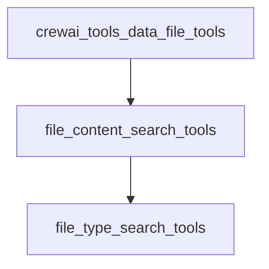

# File Content Search Tools Module

## Introduction
The `file_content_search_tools` module provides a collection of specialized RAG (Retrieval Augmented Generation) tools designed for performing semantic searches across various file formats and content types. This module enables agents to intelligently retrieve information from structured and unstructured data stored in different forms, such as CSV, DOCX, JSON, MDX, PDF, TXT, XML files, as well as entire directories and GitHub repositories. It extends the core capabilities of CrewAI by offering robust data retrieval from diverse sources.

## Architecture
The `file_content_search_tools` module is a child of the `crewai_tools_data_file_tools` module and primarily consists of a single sub-module that groups all the specific file content search tools. Each tool is built upon a common RAG framework, allowing for consistent semantic search functionality regardless of the underlying data type.

<!-- DIAGRAM_JSON
{
    "direction": "TD",
    "nodes": [
        {"id": "crewai_tools_data_file_tools", "label": "Data File Tools", "type": "external", "link": "crewai_tools_data_file_tools.md"},
        {"id": "file_content_search_tools", "label": "File Content Search Tools", "type": "module"},
        {"id": "file_type_search_tools", "label": "File Type Search Tools", "type": "module", "link": "file_type_search_tools.md"}
    ],
    "edges": [
        {"source": "crewai_tools_data_file_tools", "target": "file_content_search_tools"},
        {"source": "file_content_search_tools", "target": "file_type_search_tools"}
    ],
    "groups": []
}
-->

## Sub-modules

### [File Type Search Tools](file_type_search_tools.md)
This sub-module encapsulates all the individual tools responsible for performing semantic searches on specific file types and content sources. It includes tools like `CSVSearchTool`, `DOCXSearchTool`, `JSONSearchTool`, `MDXSearchTool`, `PDFSearchTool`, `TXTSearchTool`, `XMLSearchTool`, `DirectorySearchTool`, and `GithubSearchTool`. Each tool is tailored to extract and semantically search content from its respective data source, providing a unified interface for diverse data retrieval needs.
