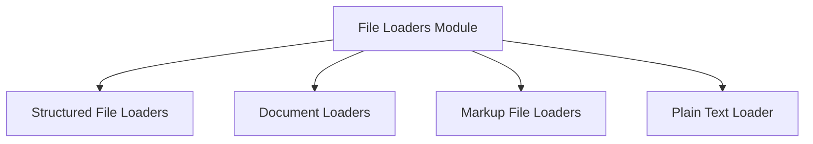

# File Loaders Module

## Introduction and Purpose

The `file_loaders` module is a crucial component within the `crewai-tools` RAG (Retrieval Augmented Generation) system, specifically designed for ingesting and processing content from various file formats. It provides a standardized interface for loading data from local files or URLs, extracting meaningful text, and generating relevant metadata, making the content ready for further RAG processing, such as chunking and embedding.

## Architecture Overview

The `file_loaders` module is structured into several sub-modules, each specializing in handling a particular category of file formats. This modular design ensures extensibility, allowing for easy integration of new file types, and promotes maintainability by segregating concerns. All loaders adhere to a common `BaseLoader` interface, ensuring consistent behavior and integration with the broader RAG pipeline.

<!-- DIAGRAM_JSON
{
    "direction": "TD",
    "nodes": [
        {"id": "structured_file_loaders", "label": "Structured File Loaders", "type": "module", "link": "structured_file_loaders.md"},
        {"id": "document_loaders", "label": "Document Loaders", "type": "module", "link": "document_loaders.md"},
        {"id": "markup_loaders", "label": "Markup File Loaders", "type": "module", "link": "markup_loaders.md"},
        {"id": "plain_text_loaders", "label": "Plain Text Loader", "type": "module", "link": "plain_text_loaders.md"}
    ],
    "edges": [
        {"source": "file_loaders", "target": "structured_file_loaders"},
        {"source": "file_loaders", "target": "document_loaders"},
        {"source": "file_loaders", "target": "markup_loaders"},
        {"source": "file_loaders", "target": "plain_text_loaders"}
    ],
    "groups": []
}
-->

## Sub-modules and their Functionality

### [Structured File Loaders](structured_file_loaders.md)
This sub-module specializes in parsing and extracting content from structured data formats such as CSV, JSON, and XML. It handles the specific parsing logic for each format, converting the structured data into a digestible text format suitable for RAG processes, while also generating relevant metadata like column headers or root tags.

### [Document Loaders](document_loaders.md)
Dedicated to handling common document formats like DOCX and PDF, this sub-module extracts textual content from these complex file types. It manages the intricacies of document parsing, including handling different sections, paragraphs, and potentially embedded objects, to provide a clean text representation.

### [Markup File Loaders](markup_loaders.md)
This sub-module focuses on loading and cleaning content from markup languages, specifically MDX (Markdown with JSX). It includes logic to strip out non-content elements like import/export statements and JSX tags, ensuring that only the relevant textual information is extracted.

### [Plain Text Loader](plain_text_loaders.md)
Providing a foundational capability, this sub-module is responsible for loading simple plain text files. It offers a straightforward approach to reading file content directly, serving as a generic text ingestion mechanism for any unstructured text data.
