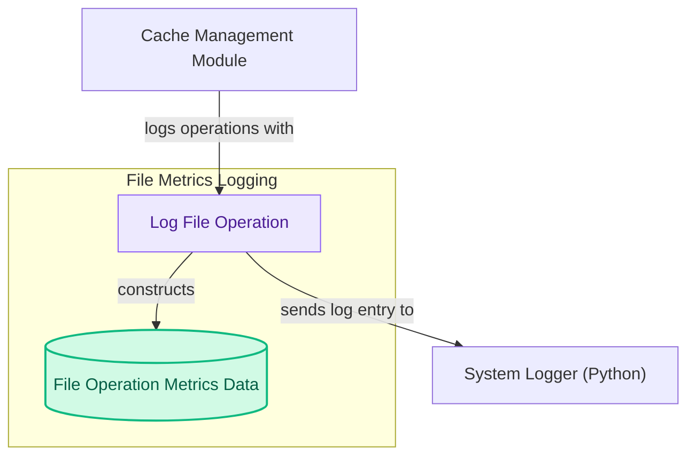

## File Operation Metrics Logging

This module provides a centralized function (`log_file_operation`) to record structured metrics for file-related activities, enabling comprehensive tracking and analysis of file operations within the system.

<!-- DIAGRAM_JSON
{
    "direction": "TD",
    "nodes": [
        {"id": "log_file_op", "label": "Log File Operation", "type": "component", "link": null},
        {"id": "metrics_data", "label": "File Operation Metrics Data", "type": "data", "link": null},
        {"id": "system_logger", "label": "System Logger (Python)", "type": "external", "link": null},
        {"id": "cache_management", "label": "Cache Management Module", "type": "external", "link": "cache_management.md"}
    ],
    "edges": [
        {"source": "cache_management", "target": "log_file_op", "label": "logs operations with"},
        {"source": "log_file_op", "target": "metrics_data", "label": "constructs"},
        {"source": "log_file_op", "target": "system_logger", "label": "sends log entry to"}
    ],
    "groups": [
        {"id": "metrics_flow", "label": "File Metrics Logging", "role": "analytical", "nodes": ["log_file_op", "metrics_data"]}
    ]
}
-->

