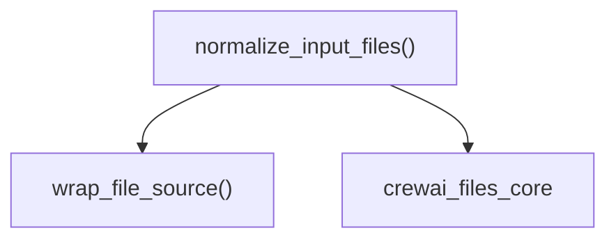

# Module: `file_normalization`

## Introduction
The `file_normalization` module, nestled within `crewai_files_resolution`, plays a crucial role in standardizing various file input formats into a unified `FileInput` dictionary. This standardization is essential for consistent and reliable file processing throughout the CrewAI file management system.

## Purpose and Core Functionality
The primary purpose of this module is to abstract away the complexities of handling diverse file inputs, such as file paths, URLs, byte streams, and existing `BaseFile` objects. It provides a single, robust function, `normalize_input_files`, that converts these disparate inputs into a consistent `FileInput` representation, keyed by a normalized file name. This ensures that downstream components can work with a predictable data structure, simplifying file resolution and processing.

## Architecture
The `file_normalization` module's architecture is straightforward, centering around its core `normalize_input_files` function. It depends on core file type definitions and source representations from the `crewai_files_core` module to perform its normalization tasks.

<!-- DIAGRAM_JSON
{
    "direction": "TD",
    "nodes": [
        {"id": "normalize_input_files", "label": "normalize_input_files()", "type": "component", "link": null},
        {"id": "wrap_file_source", "label": "wrap_file_source()", "type": "component", "link": null},
        {"id": "crewai_files_core", "label": "crewai_files_core", "type": "external", "link": "crewai_files_core.md"}
    ],
    "edges": [
        {"source": "normalize_input_files", "target": "wrap_file_source"},
        {"source": "normalize_input_files", "target": "crewai_files_core"}
    ],
    "groups": []
}
-->


## Component Details

### `normalize_input_files`
The `normalize_input_files` function is the central piece of this module. It takes a list of various file inputs and transforms them into a dictionary where keys are normalized file names and values are `FileInput` objects.

**Input Handling:**
The function intelligently processes different input types:
*   **`BaseFile` instances**: If an item is already a `BaseFile`, its filename is used, or a default name is generated if not available.
*   **File Source Objects**: Instances of `FilePath`, `FileBytes`, `FileStream`, or `FileUrl` are processed directly.
*   **`pathlib.Path` objects**: Converted into `FilePath` instances.
*   **Strings**: If a string starts with "http://" or "https://", it's treated as a `FileUrl`; otherwise, it's assumed to be a file path and converted to a `FilePath`.
*   **Bytes or `memoryview`**: Converted into `FileBytes` instances.

**Normalization Logic:**
For each input, a `name` is determined. If the input is a `BaseFile` with a filename, that filename (without extension if present) is used. Otherwise, a generic name like `file_0`, `file_1`, etc., is generated. The processed file source is then wrapped using the `wrap_file_source` helper function to produce a `FileInput` object, which is then added to the result dictionary.

```python
def normalize_input_files(
    input_files: list[FileSourceInput | FileInput],
) -> dict[str, FileInput]:
    """Convert a list of file sources to a named dictionary of FileInputs.

    Args:
        input_files: List of file source inputs or File objects.

    Returns:
        Dictionary mapping names to FileInput wrappers.
    """
    from crewai_files.core.sources import FileBytes, FilePath, FileStream, FileUrl
    from crewai_files.core.types import BaseFile

    result: dict[str, FileInput] = {}

    for i, item in enumerate(input_files):
        if isinstance(item, BaseFile):
            name = item.filename or f"file_{i}"
            if "." in name:
                name = name.rsplit(".", 1)[0]
            result[name] = item
            continue

        file_source: FilePath | FileBytes | FileStream | FileUrl
        if isinstance(item, (FilePath, FileBytes, FileStream, FileUrl)):
            file_source = item
        elif isinstance(item, Path):
            file_source = FilePath(path=item)
        elif isinstance(item, str):
            if item.startswith(("http://", "https://")):
                file_source = FileUrl(url=item)
            else:
                file_source = FilePath(path=Path(item))
        elif isinstance(item, (bytes, memoryview)):
            file_source = FileBytes(data=bytes(item))
        else:
            continue

        name = file_source.filename or f"file_{i}"
        result[name] = wrap_file_source(file_source)

    return result
```
