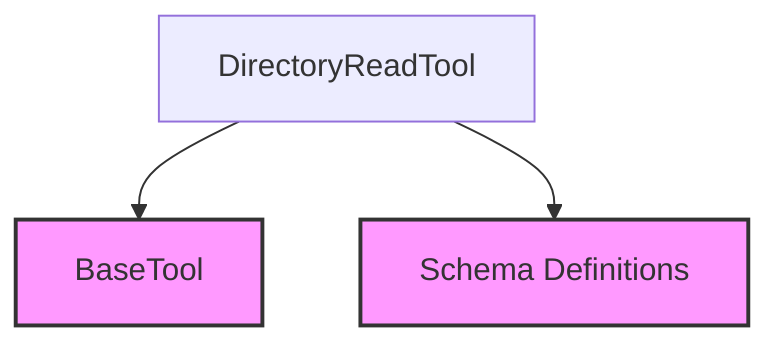

# file_reading_tools Module Documentation

## Introduction

The `file_reading_tools` module is a vital component within the CrewAI framework, providing essential functionalities for interacting with the file system, specifically for reading and listing directory contents. It offers tools that enable agents to explore and understand the structure of directories, which is crucial for tasks involving file processing, content discovery, and data management.

## Architecture and Component Relationships

The `file_reading_tools` module is designed around a single core component, the `DirectoryReadTool`, which encapsulates the logic for recursively listing files within a specified directory. This module integrates with other key parts of the CrewAI ecosystem, leveraging base tool definitions and schema management for robust and standardized operations.

### Core Component

- \`DirectoryReadTool\`: This class extends `BaseTool` and provides the primary functionality for listing all files in a given directory, including those in subdirectories. It dynamically adjusts its description and argument schema based on whether a fixed directory is provided during initialization.

### Dependencies

- \`crewai_tool_base\`: The `DirectoryReadTool` inherits from `BaseTool`, establishing a foundational dependency on the core tool definition module. This ensures adherence to the standard interface for all tools within the CrewAI framework. For more details, refer to the [crewai_tool_base documentation](crewai_tool_base.md).
- \`schema_definitions\`: The module utilizes schemas (`DirectoryReadToolSchema` and `FixedDirectoryReadToolSchema`) to define and validate the arguments for the `DirectoryReadTool`. This dependency ensures type safety and proper input handling. For more details, refer to the [schema_definitions documentation](schema_definitions.md).

<!-- DIAGRAM_JSON
{
    "direction": "TD",
    "nodes": [
        {"id": "directory_read_tool", "label": "DirectoryReadTool", "type": "component", "link": null},
        {"id": "base_tool", "label": "BaseTool", "type": "external", "link": "crewai_tool_base.md"},
        {"id": "schemas", "label": "Schema Definitions", "type": "external", "link": "schema_definitions.md"}
    ],
    "edges": [
        {"source": "directory_read_tool", "target": "base_tool"},
        {"source": "directory_read_tool", "target": "schemas"}
    ],
    "groups": []
}
-->

## How the Module Fits into the Overall System

The `file_reading_tools` module is an integral part of the `crewai_tools_data_file_tools` suite, specifically falling under `file_structure_tools`. It enables CrewAI agents to interact with the file system by providing a standardized way to list directory contents. This capability is fundamental for agents that need to:

- **Discover files**: Locate specific files or types of files within a directory structure.
- **Process data**: Identify and prepare files for further processing by other tools or agents.
- **Understand project structure**: Gain insights into the organization of codebases or data repositories.

By offering a reliable mechanism for file system introspection, `file_reading_tools` supports a wide range of agent tasks, from simple file discovery to complex data pipeline orchestration. It acts as a foundational utility that empowers agents to effectively navigate and utilize local file resources.
