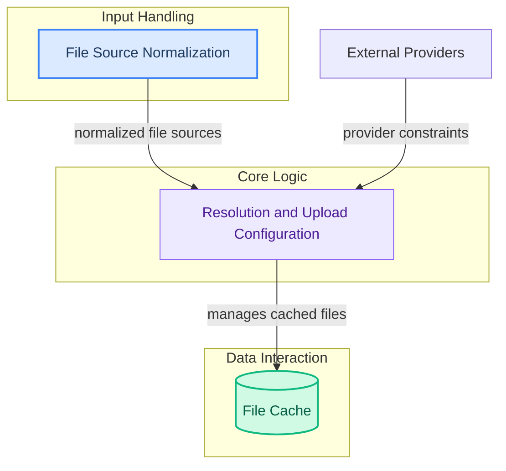

# File Resolution
This module is responsible for standardizing file inputs, resolving them into appropriate source types, and configuring strategies for file processing and uploading, including handling content type constraints for various providers.

<!-- DIAGRAM_JSON
{
    "direction": "TD",
    "nodes": [
        {
            "id": "file_resolution",
            "label": "File Resolution",
            "type": "module"
        },
        {
            "id": "file_source_normalization",
            "label": "File Source Normalization",
            "type": "module",
            "link": "file_source_normalization.md"
        },
        {
            "id": "resolution_and_upload_config",
            "label": "Resolution and Upload Configuration",
            "type": "module",
            "link": "resolution_and_upload_config.md"
        },
        {
            "id": "external_providers",
            "label": "External Providers",
            "type": "external"
        },
        {
            "id": "file_cache",
            "label": "File Cache",
            "type": "module",
            "link": "file_caching.md"
        }
    ],
    "edges": [
        {
            "source": "file_source_normalization",
            "target": "resolution_and_upload_config",
            "label": "normalized file sources"
        },
        {
            "source": "external_providers",
            "target": "resolution_and_upload_config",
            "label": "provider constraints"
        },
        {
            "source": "resolution_and_upload_config",
            "target": "file_cache",
            "label": "manages cached files"
        }
    ],
    "groups": [
        {
            "id": "input_handling",
            "label": "Input Handling",
            "role": "surface",
            "nodes": [
                "file_source_normalization"
            ]
        },
        {
            "id": "core_logic",
            "label": "Core Logic",
            "role": "analytical",
            "nodes": [
                "resolution_and_upload_config"
            ]
        },
        {
            "id": "data_interaction",
            "label": "Data Interaction",
            "role": "data",
            "nodes": [
                "file_cache"
            ]
        }
    ]
}
-->
