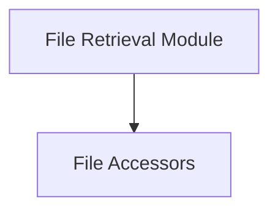

# File Retrieval Module

The `file_retrieval` module is a crucial component within the `crewai.utilities.file_store` system, designed to facilitate the retrieval of files associated with crew executions and individual tasks. It provides a synchronized interface to access file data, ensuring that other modules can easily obtain necessary file inputs.

## Architecture Overview

The `file_retrieval` module primarily interacts with underlying asynchronous file storage mechanisms to provide a synchronous retrieval interface. Its core functionality is encapsulated within dedicated file accessor components.

<!-- DIAGRAM_JSON
{
    "direction": "TD",
    "nodes": [
        {"id": "file_retrieval_module", "label": "File Retrieval Module", "type": "module"},
        {"id": "file_accessors", "label": "File Accessors", "type": "module", "link": "file_accessors.md"}
    ],
    "edges": [
        {"source": "file_retrieval_module", "target": "file_accessors"}
    ],
    "groups": []
}
-->

## Sub-modules

### [File Accessors](file_accessors.md)
This sub-module is responsible for providing the core functionality to retrieve files for both crew executions and individual tasks. It acts as the direct interface for accessing stored files.