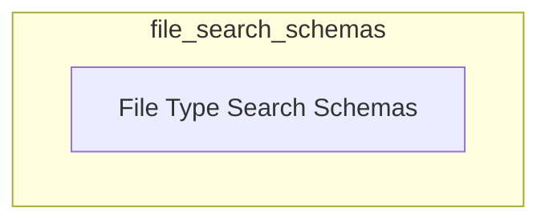

# File Search Schemas Module

## Introduction

The `file_search_schemas` module defines the input schemas for various file search tools within the CrewAI framework. These schemas ensure that the data provided to the search tools for different file types (e.g., CSV, DOCX, JSON, MDX, PDF) is correctly structured and validated.

## Architecture Overview

This module primarily consists of schemas that dictate the structure of search queries and parameters for specific file types. It is a part of the `crewai_tools_data_file_tools.schema_definitions` and interfaces with the respective file search tools to facilitate structured data input and validation.

<!-- DIAGRAM_JSON
{
    "direction": "TD",
    "nodes": [
        {"id": "file_type_search_schemas", "label": "File Type Search Schemas", "type": "module", "link": "file_type_search_schemas.md"}
    ],
    "edges": [],
    "groups": []
}
-->

## Sub-modules

### [File Type Search Schemas](file_type_search_schemas.md)
This sub-module defines the input schemas for searching various document types such as CSV, DOCX, JSON, MDX, and PDF files. Each schema specifies the required fields for initiating a search against its respective file type, ensuring consistency and validation.