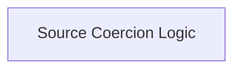

# File Source Coercion Module

The `file_source_coercion` module is responsible for standardizing various input types into a unified `FileSource` object. This ensures consistent handling of file-related data throughout the system, whether the input is a file path, raw bytes, a stream, or a URL.

## Architecture Overview

This module primarily consists of a single sub-module, `source_coercion_logic`, which encapsulates the core logic for converting diverse inputs into `FileSource` instances. It plays a crucial role in preparing data for other modules that require standardized file representations.

<!-- DIAGRAM_JSON
{
    "direction": "TD",
    "nodes": [
        {"id": "source_coercion_logic", "label": "Source Coercion Logic", "type": "module", "link": "source_coercion_logic.md"}
    ],
    "edges": []
}
-->

## Sub-modules

### [Source Coercion Logic](source_coercion_logic.md)

This sub-module contains the core functions and classes (`_normalize_source` and `_FileSourceCoercer`) responsible for transforming raw input data into structured `FileSource` objects. It provides the mechanism for robust and flexible file source interpretation, essential for seamless integration with other file handling components.