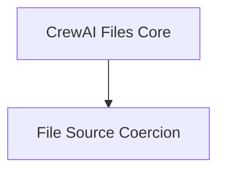

# File Source Handling Module

## Introduction
This module is responsible for standardizing the representation of various file sources within the `crewai-files` system. It provides mechanisms to normalize diverse inputs, such as file paths, URLs, byte streams, and file-like objects, into a consistent `FileSource` type.

## Architecture Overview
The `file_source_handling` module primarily consists of components focused on the coercion and normalization of file source inputs. It integrates with the `crewai_files_core` module and ensures that all file-related operations can uniformly process different types of file origins.

<!-- DIAGRAM_JSON
{
    "direction": "TD",
    "nodes": [
        {"id": "crewai_files_core", "label": "CrewAI Files Core", "type": "module", "link": "crewai_files_core.md"},
        {"id": "file_source_coercion", "label": "File Source Coercion", "type": "module", "link": "file_source_coercion.md"}
    ],
    "edges": [
        {"source": "crewai_files_core", "target": "file_source_coercion"}
    ],
    "groups": []
}
-->

## Sub-modules:

*   **[File Source Coercion](file_source_coercion.md)**: This sub-module contains the logic for converting various raw inputs (e.g., strings, paths, bytes, streams) into a standardized `FileSource` object. This ensures consistent handling of file origins throughout the system.

## Relationship to other modules:
The `file_source_handling` module is a child of the `crewai_files_core` module, inheriting core functionalities and types. It acts as a foundational layer for other file-related modules by providing normalized file source representations.