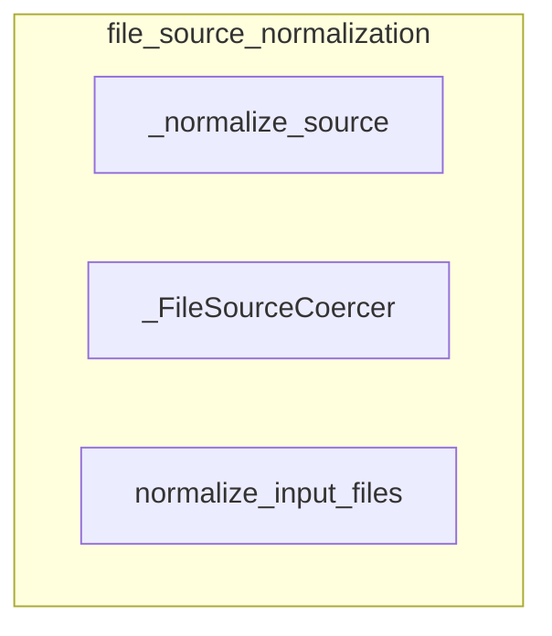

# file_source_normalization
This module provides utilities for normalizing various input types into standardized file source objects. It includes a generic conversion function, a Pydantic-compatible coercer, and a utility for processing lists of file inputs.

<!-- DIAGRAM_JSON
{
  "nodes": [
    {"id": "A", "label": "_normalize_source"},
    {"id": "B", "label": "_FileSourceCoercer"},
    {"id": "C", "label": "normalize_input_files"}
  ],
  "edges": [],
  "groups": [
    {"id": "G1", "label": "file_source_normalization", "nodes": ["A", "B", "C"]}
  ]
}
-->
