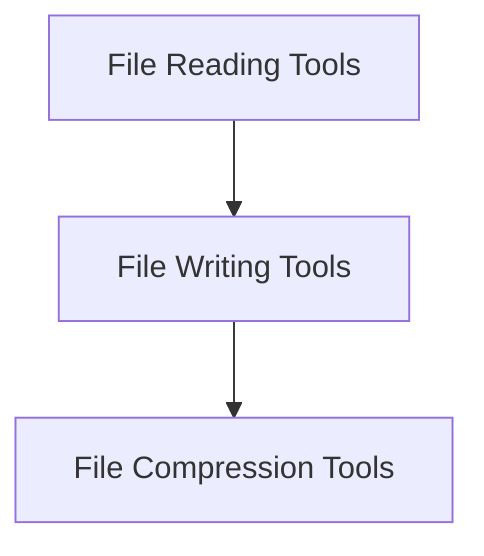

# File Structure Tools Module Documentation

## Introduction

The `file_structure_tools` module provides a set of essential utilities for interacting with the file system. It includes tools for reading directory contents, writing data to files, and compressing files or directories into archives. This module is crucial for agents that need to manage and manipulate files as part of their operations.

## Architecture Overview

The `file_structure_tools` module is composed of three main sub-modules, each focusing on a specific aspect of file system interaction:

- **File Reading Tools**: For listing directory contents.
- **File Writing Tools**: For creating and modifying files.
- **File Compression Tools**: For archiving files and directories.

These sub-modules interact with the underlying operating system to perform their respective tasks, ensuring safe and efficient file operations.

<!-- DIAGRAM_JSON
{
    "direction": "TD",
    "nodes": [
        {"id": "file_reading_tools", "label": "File Reading Tools", "type": "module", "link": "file_reading_tools.md"},
        {"id": "file_writing_tools", "label": "File Writing Tools", "type": "module", "link": "file_writing_tools.md"},
        {"id": "file_compression_tools", "label": "File Compression Tools", "type": "module", "link": "file_compression_tools.md"}
    ],
    "edges": [
        {"source": "file_reading_tools", "target": "file_writing_tools"},
        {"source": "file_writing_tools", "target": "file_compression_tools"}
    ],
    "groups": []
}
-->

## Sub-modules

### [File Reading Tools](file_reading_tools.md)
Provides utilities for programmatically listing the contents of a specified directory. This includes recursively listing files, allowing agents to discover and access files within a given path.

### [File Writing Tools](file_writing_tools.md)
Enables agents to write content to files. This tool includes important safety features like preventing path traversal, ensuring that write operations are confined to the intended directories and do not compromise system security.

### [File Compression Tools](file_compression_tools.md)
Offers functionality to compress files or entire directories into various archive formats (currently supports .zip). This is useful for archiving logs, creating backups, or preparing collections of files for transfer or storage.