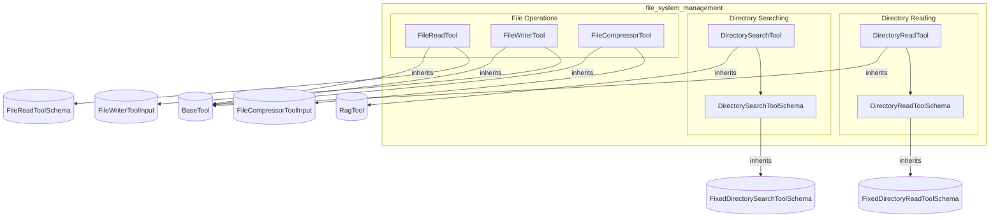

# file_system_management
This module provides a collection of tools for managing file system operations, including reading, searching, writing, and compressing files and directories.

<!-- DIAGRAM_JSON
{
    "nodes": [
        {
            "id": "DRT",
            "label": "DirectoryReadTool"
        },
        {
            "id": "DRTS",
            "label": "DirectoryReadToolSchema"
        },
        {
            "id": "DST",
            "label": "DirectorySearchTool"
        },
        {
            "id": "DSTS",
            "label": "DirectorySearchToolSchema"
        },
        {
            "id": "FRT",
            "label": "FileReadTool"
        },
        {
            "id": "FWT",
            "label": "FileWriterTool"
        },
        {
            "id": "FCT",
            "label": "FileCompressorTool"
        },
        {
            "id": "BT",
            "label": "BaseTool",
            "isExternal": true
        },
        {
            "id": "RT",
            "label": "RagTool",
            "isExternal": true
        },
        {
            "id": "FDRTS",
            "label": "FixedDirectoryReadToolSchema",
            "isExternal": true
        },
        {
            "id": "FDSSTS",
            "label": "FixedDirectorySearchToolSchema",
            "isExternal": true
        },
        {
            "id": "FRTSchema",
            "label": "FileReadToolSchema",
            "isExternal": true
        },
        {
            "id": "FWTI",
            "label": "FileWriterToolInput",
            "isExternal": true
        },
        {
            "id": "FCTI",
            "label": "FileCompressorToolInput",
            "isExternal": true
        }
    ],
    "edges": [
        {
            "source": "DRT",
            "target": "BT",
            "type": "inherits"
        },
        {
            "source": "DRT",
            "target": "DRTS",
            "type": "uses"
        },
        {
            "source": "DRTS",
            "target": "FDRTS",
            "type": "inherits"
        },
        {
            "source": "DST",
            "target": "RT",
            "type": "inherits"
        },
        {
            "source": "DST",
            "target": "DSTS",
            "type": "uses"
        },
        {
            "source": "DSTS",
            "target": "FDSSTS",
            "type": "inherits"
        },
        {
            "source": "FRT",
            "target": "BT",
            "type": "inherits"
        },
        {
            "source": "FRT",
            "target": "FRTSchema",
            "type": "uses"
        },
        {
            "source": "FWT",
            "target": "BT",
            "type": "inherits"
        },
        {
            "source": "FWT",
            "target": "FWTI",
            "type": "uses"
        },
        {
            "source": "FCT",
            "target": "BT",
            "type": "inherits"
        },
        {
            "source": "FCT",
            "target": "FCTI",
            "type": "uses"
        }
    ],
    "groups": [
        {
            "id": "file_system_management",
            "label": "file_system_management",
            "nodes": [
                "DRT",
                "DRTS",
                "DST",
                "DSTS",
                "FRT",
                "FWT",
                "FCT"
            ],
            "groups": [
                {
                    "id": "directory_reading",
                    "label": "Directory Reading",
                    "nodes": [
                        "DRT",
                        "DRTS"
                    ]
                },
                {
                    "id": "directory_searching",
                    "label": "Directory Searching",
                    "nodes": [
                        "DST",
                        "DSTS"
                    ]
                },
                {
                    "id": "file_operations",
                    "label": "File Operations",
                    "nodes": [
                        "FRT",
                        "FWT",
                        "FCT"
                    ]
                }
            ]
        }
    ]
}
-->
