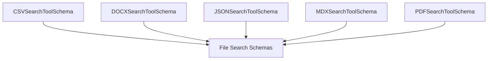

# file_type_search_schemas

## Introduction

The `file_type_search_schemas` module defines the data validation schemas for various file-type-specific search tools within the `crewai_tools_data_file_tools` ecosystem. It ensures that the inputs provided to tools for searching CSV, DOCX, JSON, MDX, and PDF files adhere to a strict format, promoting robustness and predictability in tool execution.

## Purpose and Core Functionality

The primary purpose of this module is to provide well-defined Pydantic schemas that validate the input parameters for search operations on different file types. Each schema corresponds to a specific file type and outlines the mandatory and optional fields required for a successful search. This approach facilitates:

*   **Input Validation:** Automatically validates input data against predefined rules, preventing malformed requests.
*   **Type Safety:** Ensures that tool inputs are of the expected data types.
*   **Clear API Definition:** Provides a clear and documented interface for how to interact with file-type-specific search tools.

## Architecture and Component Relationships

This module contains several schema definitions, each inheriting from a `Fixed*SearchToolSchema` (likely defined in a parent schema module), establishing a consistent base structure for file search inputs. The key components include:

### `CSVSearchToolSchema`

This schema defines the input structure for tools designed to search CSV files. It includes:

*   `csv`: A string field representing the file path or URL of the CSV file to be searched.

### `DOCXSearchToolSchema`

This schema defines the input structure for tools designed to search DOCX files. It includes:

*   `search_query`: A mandatory string field specifying the query to be used for searching the content of the DOCX file.

### `JSONSearchToolSchema`

This schema defines the input structure for tools designed to search JSON files. It includes:

*   `json_path`: A string field representing the file path or URL of the JSON file to be searched.

### `MDXSearchToolSchema`

This schema defines the input structure for tools designed to search MDX files. It includes:

*   `mdx`: A string field representing the file path or URL of the MDX file to be searched.

### `PDFSearchToolSchema`

This schema defines the input structure for tools designed to search PDF files. It includes:

*   `pdf`: A string field representing the file path or URL of the PDF file to be searched.

## How it Fits into the Overall System

The `file_type_search_schemas` module is a crucial part of the `crewai_tools_data_file_tools` suite, specifically nested under [schema_definitions.md](schema_definitions.md) and [file_search_schemas.md](file_search_schemas.md). It serves as a foundational layer by providing the necessary input validation blueprints for the actual file-type-specific search tools (e.g., in [file_type_search_tools.md](file_type_search_tools.md)). These schemas ensure that any tool interacting with different file types receives properly structured and validated arguments, contributing to the overall reliability and maintainability of the CrewAI tool ecosystem.

<!-- DIAGRAM_JSON
{
    "direction": "TD",
    "nodes": [
        {"id": "csv_schema", "label": "CSVSearchToolSchema", "type": "component", "link": null},
        {"id": "docx_schema", "label": "DOCXSearchToolSchema", "type": "component", "link": null},
        {"id": "json_schema", "label": "JSONSearchToolSchema", "type": "component", "link": null},
        {"id": "mdx_schema", "label": "MDXSearchToolSchema", "type": "component", "link": null},
        {"id": "pdf_schema", "label": "PDFSearchToolSchema", "type": "component", "link": null},
        {"id": "file_search_schemas", "label": "File Search Schemas", "type": "external", "link": "file_search_schemas.md"}
    ],
    "edges": [
        {"source": "csv_schema", "target": "file_search_schemas"},
        {"source": "docx_schema", "target": "file_search_schemas"},
        {"source": "json_schema", "target": "file_search_schemas"},
        {"source": "mdx_schema", "target": "file_search_schemas"},
        {"source": "pdf_schema", "target": "file_search_schemas"}
    ],
    "groups": []
}
-->

