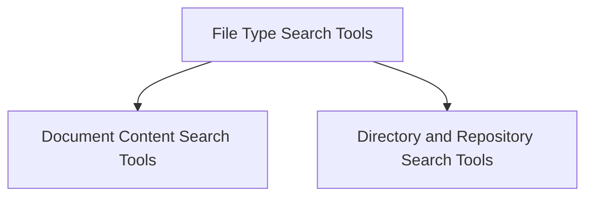

# File Type Search Tools Module

## Introduction

The `file_type_search_tools` module provides a collection of specialized tools designed for semantic searching within various file types and structural contexts. These tools extend the base RAG (Retrieval Augmented Generation) capabilities to allow agents to extract relevant information directly from specific document formats like CSV, DOCX, JSON, MDX, PDF, TXT, XML, as well as from directories and GitHub repositories.

This module is a sub-module of `file_content_search_tools`, which is part of the `crewai_tools_data_file_tools` module, focusing on enabling intelligent data retrieval from diverse content sources.

## Architecture

The `file_type_search_tools` module is structured into two main sub-modules, each focusing on a distinct category of search functionality:

1.  **Document Content Search Tools**: Handles semantic search for individual document types.
2.  **Directory and Repository Search Tools**: Manages semantic search within broader structural contexts like file directories and GitHub repositories.

Each tool within these sub-modules inherits from a base `RagTool` and implements specific logic to handle its respective data type, integrating seamlessly into the overall CrewAI RAG system.

<!-- DIAGRAM_JSON
{
    "direction": "TD",
    "nodes": [
        {"id": "file_type_search_tools", "label": "File Type Search Tools", "type": "module"},
        {"id": "document_search_tools", "label": "Document Content Search Tools", "type": "module", "link": "document_search_tools.md"},
        {"id": "structural_search_tools", "label": "Directory and Repository Search Tools", "type": "module", "link": "structural_search_tools.md"}
    ],
    "edges": [
        {"source": "file_type_search_tools", "target": "document_search_tools"},
        {"source": "file_type_search_tools", "target": "structural_search_tools"}
    ],
    "groups": []
}
-->

## Sub-modules

Here's a high-level overview of the sub-modules within `file_type_search_tools`:

*   ### [Document Content Search Tools](document_search_tools.md)
    This sub-module provides tools for performing semantic searches within various individual document types. It includes tools like `CSVSearchTool`, `DOCXSearchTool`, `JSONSearchTool`, `MDXSearchTool`, `PDFSearchTool`, `TXTSearchTool`, and `XMLSearchTool`, enabling precise information retrieval from structured and unstructured document content.

*   ### [Directory and Repository Search Tools](structural_search_tools.md)
    This sub-module offers tools for conducting semantic searches across broader structural contexts. It includes `DirectorySearchTool` for searching within local file directories and `GithubSearchTool` for performing semantic searches on GitHub repository content. These tools are crucial for understanding the overall context and relationships within a collection of files or a code repository.