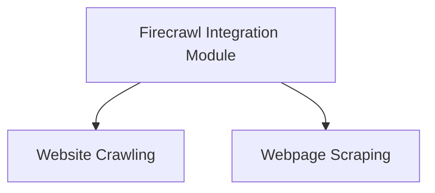

# firecrawl_integration Module Documentation

## Introduction
The `firecrawl_integration` module provides the `FirecrawlSearchTool`, enabling CrewAI agents to perform web searches using the Firecrawl v2 API. This module abstracts the complexities of interacting with the Firecrawl API, offering a streamlined way to integrate web search capabilities into automated workflows. It handles API key management and allows for extensive configuration of search and scraping parameters.

## Core Functionality
The primary component of this module is `FirecrawlSearchTool`. It is designed to:
-   **Execute Web Searches**: Perform searches on the web using a provided query through the Firecrawl v2 API.
-   **Scrape Search Results**: Automatically scrape the content of the search results with customizable options like content formats (e.g., markdown), main content extraction, and tag filtering.
-   **Manage API Key**: Securely handle the Firecrawl API key, supporting both direct initialization and environment variable loading.
-   **Install Dependencies**: Automatically prompt and install the `firecrawl-py` package if it's missing, ensuring a smooth setup experience.
-   **Configurable Search Parameters**: Allow users to specify various Firecrawl API parameters such as search limit, time-based filters, location, and request timeouts.

## Architecture and Component Relationships

The `firecrawl_integration` module is a leaf module within the `crewai_tools_web_search` package. Its core component, `FirecrawlSearchTool`, relies on external libraries and other CrewAI modules for its functionality.

<!-- DIAGRAM_JSON
{
    "direction": "TD",
    "nodes": [
        {"id": "firecrawl_search_tool", "label": "FirecrawlSearchTool", "type": "component", "link": null},
        {"id": "firecrawl_py_lib", "label": "firecrawl-py Library", "type": "external", "link": null},
        {"id": "crewai_tool_base", "label": "crewai_tool_base.BaseTool", "type": "external", "link": "crewai_tool_base.md"},
        {"id": "search_api_schemas", "label": "search_api_schemas.FirecrawlSearchToolSchema", "type": "external", "link": "search_api_schemas.md"},
        {"id": "env_vars", "label": "Environment Variables (FIRECRAWL_API_KEY)", "type": "external", "link": null}
    ],
    "edges": [
        {"source": "firecrawl_search_tool", "target": "firecrawl_py_lib"},
        {"source": "firecrawl_search_tool", "target": "crewai_tool_base"},
        {"source": "firecrawl_search_tool", "target": "search_api_schemas"},
        {"source": "firecrawl_search_tool", "target": "env_vars"}
    ],
    "groups": []
}
-->
```mermaid
graph TD
    firecrawl_search_tool[FirecrawlSearchTool]
    firecrawl_py_lib[firecrawl-py Library]
    crewai_tool_base[crewai_tool_base.BaseTool]
    search_api_schemas[search_api_schemas.FirecrawlSearchToolSchema]
    env_vars[Environment Variables (FIRECRAWL_API_KEY)]
    firecrawl_search_tool --> firecrawl_py_lib
    firecrawl_search_tool --> crewai_tool_base
    firecrawl_search_tool --> search_api_schemas
    firecrawl_search_tool --> env_vars
```

### Component Details

#### `FirecrawlSearchTool`
-   **Description**: This class extends `BaseTool` from the [crewai_tool_base](crewai_tool_base.md) module to provide web search capabilities through the Firecrawl v2 API. It encapsulates the logic for initializing the Firecrawl client, configuring search parameters, and executing search queries.
-   **Dependencies**:
    -   **`firecrawl-py` library**: The Python client library for interacting with the Firecrawl API. The tool will prompt the user to install this dependency if it's not found.
    -   **`crewai_tool_base.BaseTool`**: Serves as the base class, providing fundamental tool functionalities and integration with the CrewAI framework.
    -   **`search_api_schemas.FirecrawlSearchToolSchema`**: Defines the input schema for the `FirecrawlSearchTool`, ensuring proper validation of arguments passed to the tool. Refer to [search_api_schemas](search_api_schemas.md) for more details.
    -   **Environment Variables**: Specifically, it requires `FIRECRAWL_API_KEY` to authenticate with the Firecrawl service.

-   **Configuration**: The tool accepts an optional `config` dictionary to customize Firecrawl v2 API parameters. Key configuration options include:
    -   `limit`: Maximum number of search results.
    -   `tbs`: Time-based search filter.
    -   `location`: Geographic location for search results.
    -   `timeout`: Request timeout.
    -   `scrape_options`: Detailed options for scraping the content of search results, such as `formats`, `only_main_content`, `include_tags`, `exclude_tags`, and `wait_for`.

## Integration with the Overall System
The `firecrawl_integration` module is a specialized tool within the larger `crewai_tools_web_search` ecosystem. It extends the web search capabilities available to CrewAI agents by offering a dedicated integration with the Firecrawl API. Agents can utilize `FirecrawlSearchTool` to fetch up-to-date information from the web, scrape specific content, and incorporate this data into their decision-making and task execution processes. This module plays a crucial role in enabling agents to access and process information from external web sources, enhancing their ability to perform research, data gathering, and analysis tasks.

This module provides integration with the Firecrawl v2 API, offering tools for both crawling and scraping websites. It enables efficient extraction of web content, supporting various configurations for deep crawls and targeted content scraping.

## Architecture Overview

The `firecrawl_integration` module is composed of two primary sub-modules:

*   `website_crawler`: Focuses on deep crawling of websites.
*   `website_scraper`: Handles targeted scraping of individual web pages.

These sub-modules interact with the external Firecrawl API to perform their respective tasks, requiring an API key for authentication.

<!-- DIAGRAM_JSON
{
    "direction": "TD",
    "nodes": [
        {"id": "website_crawler", "label": "Website Crawling", "type": "module", "link": "website_crawler.md"},
        {"id": "website_scraper", "label": "Webpage Scraping", "type": "module", "link": "website_scraper.md"}
    ],
    "edges": [
        {"source": "website_crawler", "target": "website_scraper"}
    ],
    "groups": []
}
-->



## Sub-modules

### [Website Crawling](website_crawler.md)

This sub-module, powered by the `FirecrawlCrawlWebsiteTool`, provides functionality to crawl entire websites. It can navigate through links up to a specified depth, ignore sitemaps, and collect content from multiple pages based on configurable parameters like `max_discovery_depth` and `limit`.

### [Webpage Scraping](website_scraper.md)

The `website_scraper` sub-module, utilizing the `FirecrawlScrapeWebsiteTool`, is designed for precise scraping of content from individual web pages. It offers extensive configuration options to control the output format, include/exclude specific HTML tags, manage caching, and handle various request headers and timeouts.