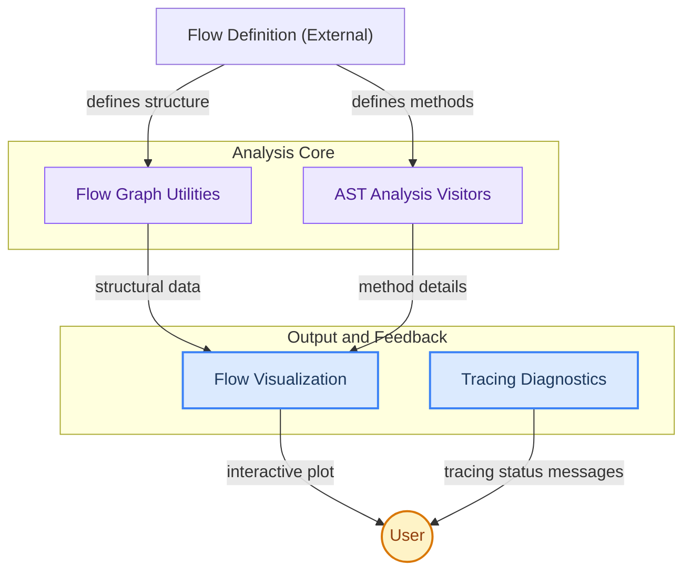

# Flow Analysis Module

This module provides essential utilities for dissecting, visualizing, and diagnosing the execution flow of CrewAI agents. It encompasses tools for understanding the internal graph structure, extracting crucial information from method definitions using AST visitors, and presenting the flow visually through interactive plots.

<!-- DIAGRAM_JSON
{
    "direction": "TD",
    "nodes": [
        {"id": "graph_utilities", "label": "Flow Graph Utilities", "type": "module", "link": "graph_utilities.md"},
        {"id": "ast_visitors", "label": "AST Analysis Visitors", "type": "module", "link": "ast_visitors.md"},
        {"id": "flow_visualization", "label": "Flow Visualization", "type": "module", "link": "flow_visualization.md"},
        {"id": "tracing_diagnostics", "label": "Tracing Diagnostics", "type": "module", "link": "tracing_diagnostics.md"},
        {"id": "flow_definition_external", "label": "Flow Definition (External)", "type": "external"},
        {"id": "user", "label": "User", "type": "external"}
    ],
    "edges": [
        {"source": "flow_definition_external", "target": "graph_utilities", "label": "defines structure"},
        {"source": "flow_definition_external", "target": "ast_visitors", "label": "defines methods"},
        {"source": "graph_utilities", "target": "flow_visualization", "label": "structural data"},
        {"source": "ast_visitors", "target": "flow_visualization", "label": "method details"},
        {"source": "flow_visualization", "target": "user", "label": "interactive plot"},
        {"source": "tracing_diagnostics", "target": "user", "label": "tracing status messages"}
    ],
    "groups": [
        {"id": "analysis_core", "label": "Analysis Core", "role": "analytical", "nodes": ["graph_utilities", "ast_visitors"]},
        {"id": "output_and_feedback", "label": "Output and Feedback", "role": "surface", "nodes": ["flow_visualization", "tracing_diagnostics"]}
    ]
}
-->
