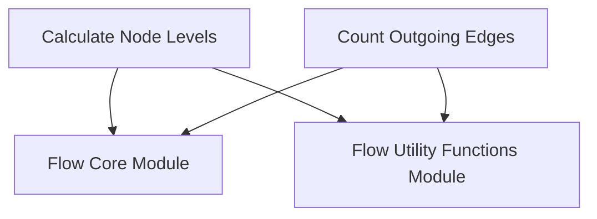

# `flow_analysis_metrics`

## Introduction

The `flow_analysis_metrics` module provides essential utilities for analyzing the structural and hierarchical characteristics of agentic flows within the CrewAI framework. It offers functions to quantify the depth, interconnectedness, and overall complexity of nodes (methods, listeners, and routers) within a defined flow, aiding in understanding and optimizing workflow structures.

## Module Purpose and Core Functionality

This module is designed to extract key metrics from a CrewAI `Flow` instance, enabling developers and maintainers to gain insights into how tasks and agents are organized and interact. Its core functionalities include:

*   **Node Level Calculation (`calculate_node_levels`):** Determines the hierarchical level of each node in a flow. This is crucial for visualizing flow progression and identifying potential bottlenecks or overly deep dependencies. Start methods are at level 0, and subsequent connected nodes are assigned incremented levels.
*   **Outgoing Edge Counting (`count_outgoing_edges`):** Quantifies the number of outgoing connections from each method. This metric helps in understanding the fan-out of a particular method, indicating its influence or the number of subsequent actions it triggers.

## Architecture and Component Relationships

The `flow_analysis_metrics` module is a leaf module residing within the `crewai_flow_management` ecosystem, specifically as part of `flow_utils.flow_graph_analysis.flow_metrics_and_hierarchy`. It directly interacts with the core `Flow` object structure and leverages shared utility functions from its parent module, `flow_utils`.

<!-- DIAGRAM_JSON
{
    "direction": "TD",
    "nodes": [
        {"id": "calc_levels", "label": "Calculate Node Levels", "type": "component", "link": null},
        {"id": "count_edges", "label": "Count Outgoing Edges", "type": "component", "link": null},
        {"id": "flow_core", "label": "Flow Core Module", "type": "external", "link": "flow_core.md"},
        {"id": "flow_utils", "label": "Flow Utility Functions Module", "type": "external", "link": "flow_utils.md"}
    ],
    "edges": [
        {"source": "calc_levels", "target": "flow_core"},
        {"source": "count_edges", "target": "flow_core"},
        {"source": "calc_levels", "target": "flow_utils"},
        {"source": "count_edges", "target": "flow_utils"}
    ],
    "groups": []
}
-->

## How the Module Fits into the Overall System

This module plays a critical role in the broader `crewai_flow_management` system by providing the analytical foundation for understanding and optimizing complex agentic workflows. The metrics generated by `flow_analysis_metrics` can be used for:

*   **Debugging and Troubleshooting:** Identifying unexpected flow structures or loops.
*   **Performance Optimization:** Pinpointing methods with high fan-out that might indicate areas for refactoring or parallelization.
*   **Visualization Tools:** Providing data points for generating graphical representations of flows, enhancing user comprehension.
*   **Advanced Flow Control:** Informing decisions within other flow management components based on structural properties.

By offering clear, quantitative insights into flow dynamics, `flow_analysis_metrics` supports the development of more robust, efficient, and understandable AI-driven workflows.

