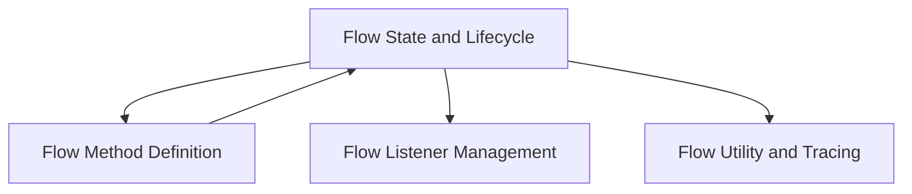

# Flow Core Module

The `flow_core` module is the central component for defining, managing, and executing automated flows within the system. It provides the foundational classes and mechanisms for flow creation, state management, execution control, and interaction with human feedback.

## Architecture Overview

The `flow_core` module is structured around the `Flow` class, which serves as the primary entry point for flow definitions. It integrates with various sub-modules to handle specific aspects of flow execution, state persistence, event handling, and visualization.

<!-- DIAGRAM_JSON
{
    "direction": "TD",
    "nodes": [
        {"id": "flow_state_and_lifecycle", "label": "Flow State and Lifecycle", "type": "module", "link": "flow_state_and_lifecycle.md"},
        {"id": "flow_method_definition", "label": "Flow Method Definition", "type": "module", "link": "flow_method_definition.md"},
        {"id": "flow_listener_management", "label": "Flow Listener Management", "type": "module", "link": "flow_listener_management.md"},
        {"id": "flow_utility_and_tracing", "label": "Flow Utility and Tracing", "type": "module", "link": "flow_utility_and_tracing.md"}
    ],
    "edges": [
        {"source": "flow_state_and_lifecycle", "target": "flow_method_definition"},
        {"source": "flow_state_and_lifecycle", "target": "flow_listener_management"},
        {"source": "flow_state_and_lifecycle", "target": "flow_utility_and_tracing"},
        {"source": "flow_method_definition", "target": "flow_state_and_lifecycle"}
    ],
    "groups": []
}
-->

## Sub-modules

Here are the core sub-modules within `flow_core`:

*   **[Flow State and Lifecycle](flow_state_and_lifecycle.md)**: This sub-module is responsible for managing the state, initialization, and overall lifecycle of a flow, including resuming and reloading its execution.

*   **[Flow Method Definition](flow_method_definition.md)**: This sub-module handles the definition and metadata of flow methods, including decorators for flow control and logical conditions.

*   **[Flow Listener Management](flow_listener_management.md)**: This sub-module manages how 'OR' listeners are triggered atomically within the flow execution.

*   **[Flow Utility and Tracing](flow_utility_and_tracing.md)**: This sub-module provides utility functions, including displaying tracing status messages and generating flow visualizations.
