# `flow_core_definition` Module Documentation

## Introduction

The `flow_core_definition` module is a fundamental component of the CrewAI framework, primarily encapsulating the `Flow` class. This module serves as the bedrock for defining, executing, and managing complex, multi-step automated processes (flows). It provides comprehensive capabilities for state management, event handling, memory integration, human feedback loops, and persistence, enabling the creation of robust and interactive AI-driven workflows.

## Comprehensive Documentation

### Purpose and Core Functionality

The `Flow` class is the central abstraction within this module. It allows developers to define a sequence of interconnected methods that constitute a "flow." These methods can be triggered by various conditions, including explicit starts, the completion of other methods (listeners), or routing decisions.

Key functionalities of the `Flow` class include:

*   **Flow Definition:** Acts as a base class for user-defined flows, allowing for type-hinted state management through Pydantic models or dictionaries.
*   **State Management:** Manages the internal state of a flow, supporting both dictionary-based and Pydantic `BaseModel`-based states. It handles state initialization, updates, copying, and restoration from persistence.
*   **Execution Lifecycle:** Orchestrates the lifecycle of a flow from `kickoff` (start) to `FlowFinishedEvent`. It supports both synchronous and asynchronous execution (`kickoff`, `kickoff_async`, `akickoff`).
*   **Method Execution and Eventing:** Executes flow methods, managing their call counts and tracking completion. It extensively uses the [CrewAI Event System](crewai_event_system.md) to emit various events throughout the flow and method execution lifecycle, enabling observability and external integrations.
*   **Listener and Router System:** Implements a sophisticated system for triggering methods based on conditions (`@listen`, `@router`). It supports `AND` and `OR` conditions, including nested ones, and handles racing conditions among `OR` listeners.
*   **Human Feedback Integration:** Provides mechanisms for pausing flow execution to request human feedback (`_request_human_feedback`, `ask`) and resuming (`resume`, `resume_async`) once feedback is received. It includes functionality to collapse free-form feedback into predefined outcomes using an LLM.
*   **Memory Management:** Integrates with the [CrewAI Memory Analysis](crewai_memory_analysis.md) system, allowing flows to `recall`, `remember`, and `extract_memories`, providing contextual awareness across flow steps.
*   **Persistence and Checkpointing:** Supports saving and restoring flow state using a [Flow Persistence](flow_persistence.md) backend, crucial for long-running flows or those requiring human intervention.
*   **Input Handling:** Offers a flexible input system (`ask`) that can be customized via an [Input Provider](flow_input_provider.md), enabling interaction with various input sources (e.g., console, webhooks).
*   **Tracing and Logging:** Incorporates tracing capabilities and centralized logging for better debugging and understanding of flow execution.
*   **Visualization:** Provides a `plot` method to generate interactive HTML visualizations of the flow's structure and execution path.

### Architecture and Component Relationships

The `Flow` class is a central orchestrator within the `crewai_flow_management` ecosystem. It interacts with several other CrewAI modules to deliver its comprehensive functionality.

<!-- DIAGRAM_JSON
{
    "direction": "TD",
    "nodes": [
        {"id": "flow_class", "label": "Flow Class", "type": "component", "link": null},
        {"id": "flow_state_and_lifecycle", "label": "Flow State and Lifecycle", "type": "external", "link": "flow_state_and_lifecycle.md"},
        {"id": "flow_persistence", "label": "Flow Persistence", "type": "external", "link": "flow_persistence.md"},
        {"id": "crewai_event_system", "label": "CrewAI Event System", "type": "external", "link": "crewai_event_system.md"},
        {"id": "crewai_llm_integrations", "label": "CrewAI LLM Integrations", "type": "external", "link": "crewai_llm_integrations.md"},
        {"id": "flow_input_provider", "label": "Flow Input Provider", "type": "external", "link": "flow_input_provider.md"},
        {"id": "flow_config", "label": "Flow Config", "type": "external", "link": "flow_config.md"},
        {"id": "flow_context", "label": "Flow Context", "type": "external", "link": "flow_context.md"},
        {"id": "flow_human_feedback", "label": "Flow Human Feedback", "type": "external", "link": "flow_human_feedback.md"},
        {"id": "crewai_utilities", "label": "CrewAI Utilities", "type": "external", "link": "crewai_utilities.md"},
        {"id": "flow_visualization", "label": "Flow Visualization", "type": "external", "link": "flow_visualization.md"},
        {"id": "crewai_memory_analysis", "label": "CrewAI Memory Analysis", "type": "external", "link": "crewai_memory_analysis.md"}
    ],
    "edges": [
        {"source": "flow_class", "target": "flow_state_and_lifecycle"},
        {"source": "flow_class", "target": "flow_persistence"},
        {"source": "flow_class", "target": "crewai_event_system"},
        {"source": "flow_class", "target": "crewai_llm_integrations"},
        {"source": "flow_class", "target": "flow_input_provider"},
        {"source": "flow_class", "target": "flow_config"},
        {"source": "flow_class", "target": "flow_context"},
        {"source": "flow_class", "target": "flow_human_feedback"},
        {"source": "flow_class", "target": "crewai_utilities"},
        {"source": "flow_class", "target": "crewai_memory_analysis"},
        {"source": "flow_class", "target": "flow_visualization"}
    ],
    "groups": []
}
-->

```mermaid
graph TD
    flow_class[Flow Class]
    flow_state_and_lifecycle[Flow State and Lifecycle]
    flow_persistence[Flow Persistence]
    crewai_event_system[CrewAI Event System]
    crewai_llm_integrations[CrewAI LLM Integrations]
    flow_input_provider[Flow Input Provider]
    flow_config[Flow Config]
    flow_context[Flow Context]
    flow_human_feedback[Flow Human Feedback]
    crewai_utilities[CrewAI Utilities]
    flow_visualization[Flow Visualization]
    crewai_memory_analysis[CrewAI Memory Analysis]
    flow_class --> flow_state_and_lifecycle
    flow_class --> flow_persistence
    flow_class --> crewai_event_system
    flow_class --> crewai_llm_integrations
    flow_class --> flow_input_provider
    flow_class --> flow_config
    flow_class --> flow_context
    flow_class --> flow_human_feedback
    flow_class --> crewai_utilities
    flow_class --> crewai_memory_analysis
    flow_class --> flow_visualization
```

### How the Module Fits into the Overall System

The `flow_core_definition` module, through its `Flow` class, is at the heart of defining and executing agentic workflows in CrewAI. It resides within the `crewai_flow_management` module, which is responsible for the overarching orchestration of flows.

*   **Integration with Agents and Tasks:** While `Flow` defines the control plane for orchestrating methods, these methods often involve interactions with agents and tasks defined in other core CrewAI modules (e.g., `crewai_agent_core`, `crewai_task_management`). The `Flow` provides the structure for how agents collaborate and how tasks are executed in a coordinated manner.
*   **Event-Driven Architecture:** Its deep integration with the [CrewAI Event System](crewai_event_system.md) makes it a central publisher and subscriber of events, allowing other parts of the CrewAI framework (like monitoring tools, UI components, or external services) to react to changes in flow state and method execution.
*   **Extensibility:** By providing clear interfaces for `InputProvider` and `FlowPersistence`, the module allows for customization and integration with diverse external systems for user interaction and data storage.
*   **Foundation for Complex Behaviors:** The `Flow` class, with its support for conditional logic, human feedback, and memory, serves as a powerful foundation for building complex, adaptable, and intelligent multi-agent systems that can learn, adapt, and interact with users effectively.

In essence, `flow_core_definition` provides the essential blueprint and execution engine that brings complex CrewAI workflows to life, connecting various functional modules into a cohesive and intelligent system.