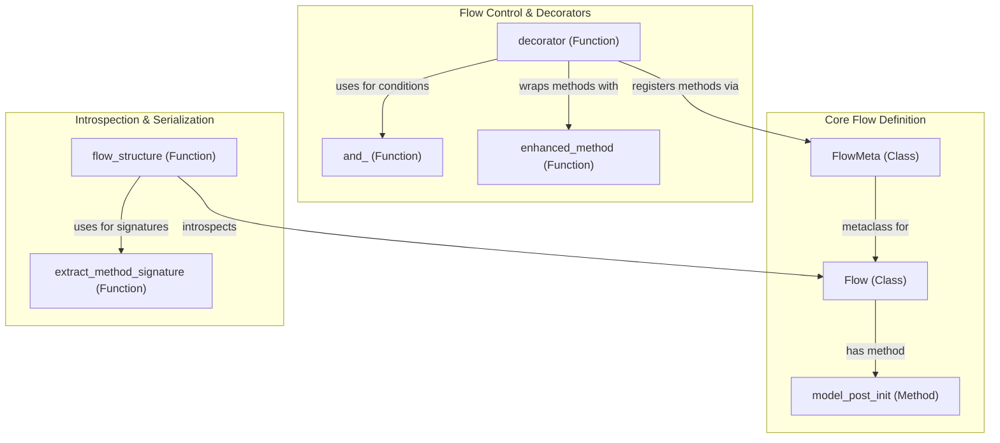

# flow_definition
This module defines the core `Flow` class, its metadata handling, and utilities for structuring and introspecting flow components.

<!-- DIAGRAM_JSON
{
  "nodes": [
    {"id": "FlowMeta", "label": "FlowMeta", "type": "class"},
    {"id": "Flow", "label": "Flow", "type": "class"},
    {"id": "model_post_init", "label": "model_post_init", "type": "method"},
    {"id": "decorator", "label": "decorator", "type": "function"},
    {"id": "and_", "label": "and_", "type": "function"},
    {"id": "enhanced_method", "label": "enhanced_method", "type": "function"},
    {"id": "flow_structure", "label": "flow_structure", "type": "function"},
    {"id": "extract_method_signature", "label": "extract_method_signature", "type": "function"}
  ],
  "edges": [
    {"source": "FlowMeta", "target": "Flow", "label": "metaclass for"},
    {"source": "Flow", "target": "model_post_init", "label": "has method"},
    {"source": "decorator", "target": "FlowMeta", "label": "registers methods via"},
    {"source": "decorator", "target": "and_", "label": "uses for conditions"},
    {"source": "decorator", "target": "enhanced_method", "label": "wraps methods with"},
    {"source": "flow_structure", "target": "Flow", "label": "introspects"},
    {"source": "flow_structure", "target": "extract_method_signature", "label": "uses for signatures"}
  ],
  "groups": [
    {"id": "core_flow", "label": "Core Flow Definition", "nodes": ["FlowMeta", "Flow", "model_post_init"]},
    {"id": "flow_control", "label": "Flow Control & Decorators", "nodes": ["decorator", "and_", "enhanced_method"]},
    {"id": "introspection", "label": "Introspection & Serialization", "nodes": ["flow_structure", "extract_method_signature"]}
  ]
}
-->
