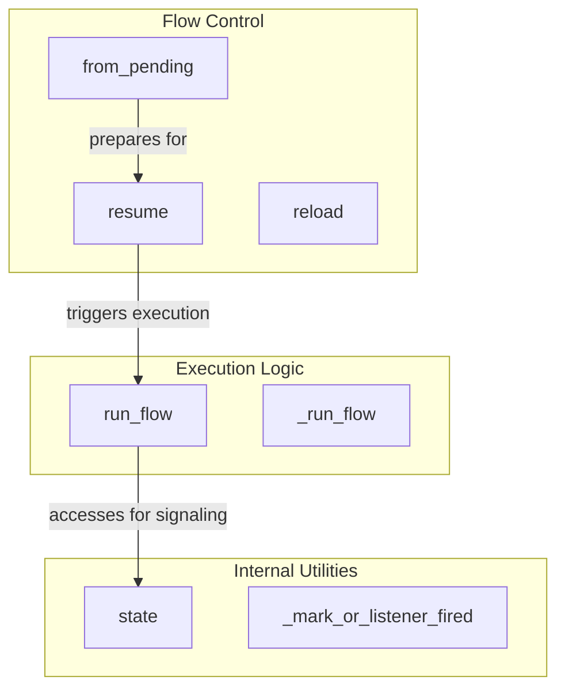

# flow_execution
Manages the lifecycle and execution of flows, including pausing for human feedback, resuming, and state management.

<!-- DIAGRAM_JSON
{
  "nodes": [
    {
      "id": "resume",
      "label": "resume"
    },
    {
      "id": "from_pending",
      "label": "from_pending"
    },
    {
      "id": "state",
      "label": "state"
    },
    {
      "id": "reload",
      "label": "reload"
    },
    {
      "id": "run_flow",
      "label": "run_flow"
    },
    {
      "id": "_run_flow",
      "label": "_run_flow"
    },
    {
      "id": "_mark_or_listener_fired",
      "label": "_mark_or_listener_fired"
    }
  ],
  "edges": [
    {
      "source": "from_pending",
      "target": "resume",
      "label": "prepares for"
    },
    {
      "source": "resume",
      "target": "run_flow",
      "label": "triggers execution"
    },
    {
      "source": "run_flow",
      "target": "state",
      "label": "accesses for signaling"
    }
  ],
  "groups": [
    {
      "id": "flow_control",
      "label": "Flow Control",
      "nodes": [
        "from_pending",
        "resume",
        "reload"
      ]
    },
    {
      "id": "execution_logic",
      "label": "Execution Logic",
      "nodes": [
        "run_flow",
        "_run_flow"
      ]
    },
    {
      "id": "internal_utilities",
      "label": "Internal Utilities",
      "nodes": [
        "state",
        "_mark_or_listener_fired"
      ]
    }
  ]
}
-->
