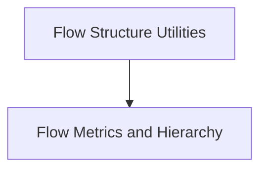

# Flow Graph Analysis Module

## Introduction and Purpose
The `flow_graph_analysis` module is a crucial component within the `crewai.flow.utils` package, designed to provide comprehensive tools for understanding and dissecting the structure and behavior of operational flows. It enables developers and maintainers to gain insights into node relationships, hierarchical levels, and dependencies, which are essential for debugging, optimization, and visualization of complex process flows.

## Architecture Overview
This module is structured into two main sub-modules, each focusing on a distinct aspect of flow graph analysis:

1.  **Flow Structure Utilities**: Concentrates on identifying and mapping static structural relationships like ancestors and parent-child connections.
2.  **Flow Metrics and Hierarchy**: Focuses on quantitative analysis, such as calculating node levels and counting outgoing edges, to understand the flow's complexity and progression.

These sub-modules work in tandem to provide a holistic view of the flow graph, allowing for both detailed structural inspection and high-level metric-based understanding.

<!-- DIAGRAM_JSON
{
    "direction": "TD",
    "nodes": [
        {"id": "flow_structure_utilities", "label": "Flow Structure Utilities", "type": "module", "link": "flow_structure_utilities.md"},
        {"id": "flow_metrics_and_hierarchy", "label": "Flow Metrics and Hierarchy", "type": "module", "link": "flow_metrics_and_hierarchy.md"}
    ],
    "edges": [
        {"source": "flow_structure_utilities", "target": "flow_metrics_and_hierarchy"}
    ],
    "groups": []
}
-->

## Sub-modules

### [Flow Structure Utilities](flow_structure_utilities.md)
This sub-module is responsible for analyzing the structural relationships within a flow graph, providing tools to build dictionaries of ancestors and parent-child relationships. It helps in understanding how different nodes are interconnected and dependent on each other.

### [Flow Metrics and Hierarchy](flow_metrics_and_hierarchy.md)
This sub-module focuses on the quantitative and hierarchical aspects of the flow graph. It includes functions for calculating the hierarchical level of each node and counting the number of outgoing edges, which are crucial for understanding the depth and branching of the flow.
