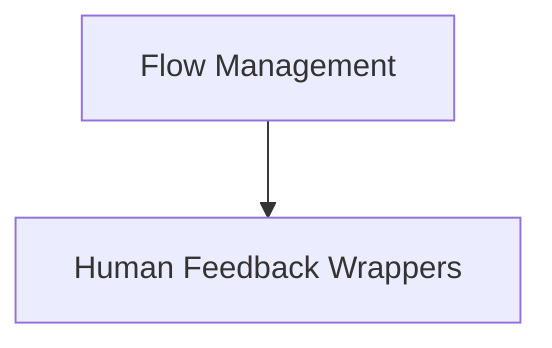

# `flow_human_feedback` Module Documentation

## Introduction

The `flow_human_feedback` module is a critical component within the CrewAI framework, designed to integrate human-in-the-loop (HITL) interactions into AI-driven flows. It provides mechanisms for agents to request and incorporate human feedback, enabling refinement and learning within complex workflows. This module ensures that AI operations can be reviewed, corrected, and enhanced by human insights, leading to more robust and accurate outcomes.

## Architecture Overview

The `flow_human_feedback` module primarily consists of wrappers that intercept flow execution to introduce human feedback steps. These wrappers manage the process of presenting agent outputs to a human, capturing their feedback, and then processing that feedback to potentially influence subsequent agent actions or for learning purposes. It interacts closely with the `flow_management` module for overall flow control and potentially with a memory system for storing and applying lessons learned from human feedback.

## Sub-modules

### [Human Feedback Wrappers](feedback_wrappers.md)

This sub-module contains the core logic for wrapping flow methods to enable human feedback. It provides both synchronous and asynchronous wrappers that handle pre-review processes, feedback requests, result processing, and the distillation of lessons from human input.

<!-- DIAGRAM_JSON
{
    "direction": "TD",
    "nodes": [
        {"id": "flow_management", "label": "Flow Management", "type": "module", "link": "flow_management.md"},
        {"id": "feedback_wrappers", "label": "Human Feedback Wrappers", "type": "module", "link": "feedback_wrappers.md"}
    ],
    "edges": [
        {"source": "flow_management", "target": "feedback_wrappers"}
    ],
    "groups": []
}
-->

