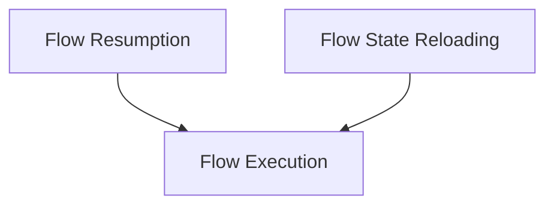

# Flow Lifecycle Module

## Introduction and Purpose
The `flow_lifecycle` module is a critical component within the CrewAI framework, specifically designed to manage the various stages of a flow's execution. It orchestrates the initiation, pausing, resuming, and state restoration of complex multi-agent workflows. This module ensures that flows can gracefully handle asynchronous operations, human feedback, and persistent execution across different sessions, providing a robust and resilient execution environment.

## Architecture Overview
The `flow_lifecycle` module sits within the `flow_state_and_lifecycle` sub-module, which is part of the broader `flow_core` and `crewai_flow_management` structure. It interacts closely with persistence layers for saving and loading flow states, allowing for seamless continuation of paused workflows. Its design supports integration with asynchronous execution mechanisms and robust error handling during flow execution.

<!-- DIAGRAM_JSON
{
    "direction": "TD",
    "nodes": [
        {"id": "flow_resumption", "label": "Flow Resumption", "type": "module", "link": "flow_resumption.md"},
        {"id": "flow_state_reloading", "label": "Flow State Reloading", "type": "module", "link": "flow_state_reloading.md"},
        {"id": "flow_execution", "label": "Flow Execution", "type": "module", "link": "flow_execution.md"}
    ],
    "edges": [
        {"source": "flow_resumption", "target": "flow_execution"},
        {"source": "flow_state_reloading", "target": "flow_execution"}
    ],
    "groups": []
}
-->

## Sub-modules

### [Flow Resumption](flow_resumption.md)
This sub-module is dedicated to managing the pausing and resuming of flows, particularly in scenarios where human feedback is required. It provides mechanisms to restore a flow from a pending state and inject feedback to continue its execution.

### [Flow State Reloading](flow_state_reloading.md)
The Flow State Reloading sub-module is responsible for the restoration of a flow's execution state from previously saved data. This functionality is crucial for maintaining flow continuity and allowing long-running or interrupted flows to pick up where they left off.

### [Flow Execution](flow_execution.md)
This sub-module oversees the initiation and execution of a flow. It encapsulates the core logic for running a workflow, handling inputs, and managing the overall execution lifecycle, including the graceful handling of expected control flow exceptions like `HumanFeedbackPending`.