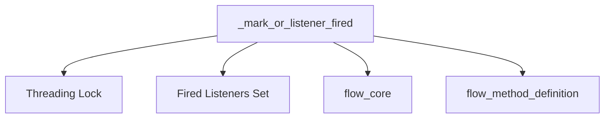

# Module: `flow_listener_management`

## Introduction
The `flow_listener_management` module is a vital component within the CrewAI flow system, specifically designed to handle and track the activation of "OR" listeners. It ensures that actions triggered by these listeners are executed atomically and idempotently, preventing redundant processing even when multiple conditions might concurrently attempt to fire the same listener.

## Purpose and Core Functionality
This module's primary purpose is to provide a robust mechanism for managing the state of "OR" listeners within a flow. "OR" listeners are typically associated with conditional logic where any one of several events or conditions can trigger a specific action or transition in the flow.

The core functionality is encapsulated in the `_mark_or_listener_fired` function. This function atomically marks a given listener as "fired." Its key features include:
-   **Atomic Execution**: Utilizes a threading lock (`_or_listeners_lock`) to ensure that marking a listener as fired is a thread-safe operation, preventing race conditions in concurrent environments.
-   **Idempotency**: A listener, once marked as fired, cannot be marked again by subsequent calls. The function returns `True` only for the first successful marking, and `False` for any subsequent attempts, ensuring that the associated action is performed only once.

This mechanism is crucial for building reliable and predictable flows, especially in scenarios where multiple parallel paths or events could potentially lead to the same state change or action.

## Architecture and Component Relationships

The `flow_listener_management` module is a sub-module of `flow_core`, which in turn is part of the larger `crewai_flow_management` system.

### Internal Components
-   `_mark_or_listener_fired`: The central function responsible for the atomic marking of "OR" listeners.
-   `_or_listeners_lock`: An internal threading lock used by `_mark_or_listener_fired` to ensure thread-safe operations.
-   `_fired_or_listeners`: An internal set used by `_mark_or_listener_fired` to keep track of listeners that have already been fired.

### External Dependencies
-   **`flow_core`**: As a sub-module, `flow_listener_management` is tightly integrated with `flow_core` to manage the overall flow execution logic. (See: [flow_core.md](flow_core.md))
-   **`flow_method_definition`**: The `FlowMethodName` type, used as an argument to `_mark_or_listener_fired`, likely originates from or is defined in conjunction with `flow_method_definition` as it refers to names of methods within the flow. (See: [flow_method_definition.md](flow_method_definition.md))

## How the Module Fits into the Overall System
The `flow_listener_management` module is an indispensable part of the `crewai_flow_management` ecosystem. It underpins the reliable execution of complex, conditional flows by providing a mechanism to manage "OR" logic listeners. By ensuring that listener-triggered actions are executed exactly once, it contributes to the overall stability, predictability, and correctness of automated processes within CrewAI. It prevents unintended side effects from multiple activations and simplifies the development of robust flow orchestration.

<!-- DIAGRAM_JSON
{
    "direction": "TD",
    "nodes": [
        {"id": "_mark_or_listener_fired", "label": "_mark_or_listener_fired", "type": "component", "link": null},
        {"id": "_or_listeners_lock", "label": "Threading Lock", "type": "component", "link": null},
        {"id": "_fired_or_listeners", "label": "Fired Listeners Set", "type": "component", "link": null},
        {"id": "flow_core", "label": "flow_core", "type": "external", "link": "flow_core.md"},
        {"id": "flow_method_definition", "label": "flow_method_definition", "type": "external", "link": "flow_method_definition.md"}
    ],
    "edges": [
        {"source": "_mark_or_listener_fired", "target": "_or_listeners_lock"},
        {"source": "_mark_or_listener_fired", "target": "_fired_or_listeners"},
        {"source": "_mark_or_listener_fired", "target": "flow_core"},
        {"source": "_mark_or_listener_fired", "target": "flow_method_definition"}
    ],
    "groups": []
}
-->

