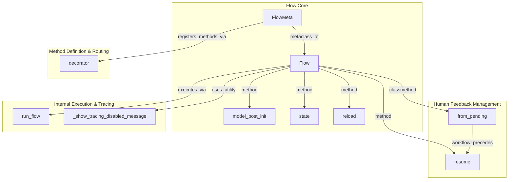

# flow_management
The `flow_management` module defines the core `Flow` class for orchestrating complex, stateful execution flows, including mechanisms for human feedback, checkpointing, state persistence, and method routing.

<!-- DIAGRAM_JSON -->
```json
{
  "nodes": [
    {"id": "Flow", "label": "Flow"},
    {"id": "FlowMeta", "label": "FlowMeta"},
    {"id": "resume", "label": "resume"},
    {"id": "from_pending", "label": "from_pending"},
    {"id": "model_post_init", "label": "model_post_init"},
    {"id": "decorator", "label": "decorator"},
    {"id": "state", "label": "state"},
    {"id": "reload", "label": "reload"},
    {"id": "run_flow", "label": "run_flow"},
    {"id": "_show_tracing_disabled_message", "label": "_show_tracing_disabled_message"}
  ],
  "edges": [
    {"source": "FlowMeta", "target": "Flow", "label": "metaclass_of"},
    {"source": "Flow", "target": "resume", "label": "method"},
    {"source": "Flow", "target": "from_pending", "label": "classmethod"},
    {"source": "Flow", "target": "model_post_init", "label": "method"},
    {"source": "Flow", "target": "state", "label": "method"},
    {"source": "Flow", "target": "reload", "label": "method"},
    {"source": "Flow", "target": "run_flow", "label": "executes_via"},
    {"source": "Flow", "target": "_show_tracing_disabled_message", "label": "uses_utility"},
    {"source": "from_pending", "target": "resume", "label": "workflow_precedes"},
    {"source": "FlowMeta", "target": "decorator", "label": "registers_methods_via"}
  ],
  "groups": [
    {
      "id": "flow_core",
      "label": "Flow Core",
      "nodes": ["Flow", "FlowMeta", "model_post_init", "state", "reload"]
    },
    {
      "id": "human_feedback_management",
      "label": "Human Feedback Management",
      "nodes": ["from_pending", "resume"]
    },
    {
      "id": "method_definition_routing",
      "label": "Method Definition & Routing",
      "nodes": ["decorator"]
    },
    {
      "id": "internal_execution_tracing",
      "label": "Internal Execution & Tracing",
      "nodes": ["run_flow", "_show_tracing_disabled_message"]
    }
  ]
}
```
<!-- /DIAGRAM_JSON -->
