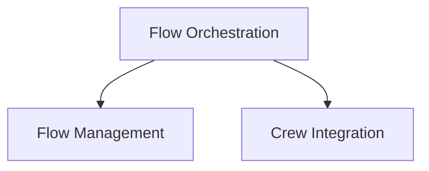

# Flow Management Module

## Introduction and Purpose
The `flow_management` module, a sub-module of `crewai_cli.flow_orchestration`, provides command-line interface (CLI) functionalities to manage and visualize agent flows within the CrewAI framework. It serves as the entry point for users to initiate the execution of a defined flow and generate visual representations of its structure.

## Architecture and Component Relationships
This module integrates with the broader `flow_orchestration` capabilities, enabling direct interaction with agent flows through the CLI. It leverages other components within the CLI for output and visual rendering.

<!-- DIAGRAM_JSON
{
    "direction": "TD",
    "nodes": [
        {"id": "flow_management", "label": "Flow Management", "type": "module", "link": "flow_management.md"},
        {"id": "flow_orchestration", "label": "Flow Orchestration", "type": "module", "link": "flow_orchestration.md"},
        {"id": "crew_integration", "label": "Crew Integration", "type": "module", "link": "crew_integration.md"}
    ],
    "edges": [
        {"source": "flow_orchestration", "target": "flow_management"},
        {"source": "flow_orchestration", "target": "crew_integration"}
    ],
    "groups": []
}
-->

## Core Functionality

### `flow_run`
This function is responsible for initiating the execution of a defined agent flow. It acts as the primary command-line interface for users to "kickoff" a flow, setting it in motion within the CrewAI system.

### `flow_plot`
This function generates a visual plot or diagram of the agent flow. It allows users to understand the structure, dependencies, and sequence of operations within a flow, aiding in debugging and comprehension.

## How the Module Fits into the Overall System
The `flow_management` module is a critical part of the CrewAI CLI, providing the direct means for users to interact with and observe agent flows. It sits under the `flow_orchestration` umbrella, working alongside other modules like `crew_integration` to offer a comprehensive set of tools for managing AI agent operations. It interacts with the core `crewai_flow_management` module (e.g., [crewai_flow_management.md](crewai_flow_management.md)) for the actual flow definitions and execution logic.
