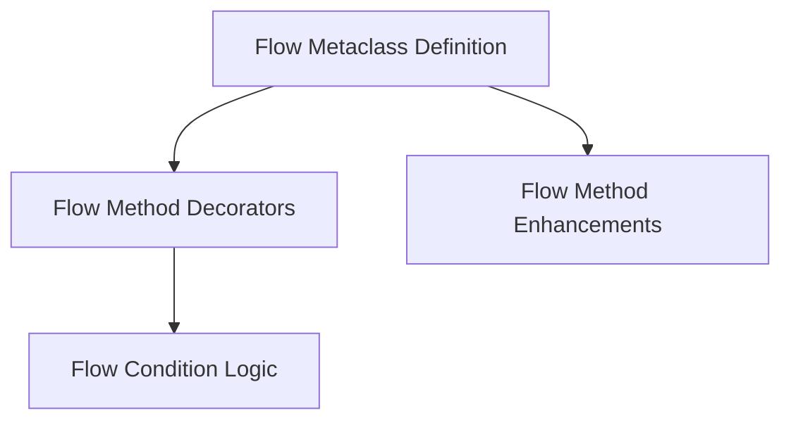

# `flow_method_definition` Module Documentation

## Introduction
This module is central to defining and managing the methods and logic within a CrewAI flow. It provides the metaclass, decorators, and utilities necessary to transform regular Python methods into sophisticated flow-aware components, enabling complex orchestration, conditional execution, and routing within an agentic workflow.

## Architecture Overview
The `flow_method_definition` module is structured around a metaclass that inspects and registers specific attributes of methods marked for flow control. Decorators are used to infuse methods with flow-specific metadata, while condition logic utilities allow for advanced triggering rules. Enhanced methods ensure that flow-specific behavior is injected during execution.

<!-- DIAGRAM_JSON
{
    "direction": "TD",
    "nodes": [
        {"id": "flow_metaclass", "label": "Flow Metaclass Definition", "type": "module", "link": "flow_metaclass.md"},
        {"id": "flow_method_decorators", "label": "Flow Method Decorators", "type": "module", "link": "flow_method_decorators.md"},
        {"id": "flow_condition_logic", "label": "Flow Condition Logic", "type": "module", "link": "flow_condition_logic.md"},
        {"id": "flow_method_enhancements", "label": "Flow Method Enhancements", "type": "module", "link": "flow_method_enhancements.md"}
    ],
    "edges": [
        {"source": "flow_metaclass", "target": "flow_method_decorators"},
        {"source": "flow_method_decorators", "target": "flow_condition_logic"},
        {"source": "flow_metaclass", "target": "flow_method_enhancements"}
    ],
    "groups": []
}
-->

## Sub-modules
*   [Flow Metaclass Definition](flow_metaclass.md)
*   [Flow Method Decorators](flow_method_decorators.md)
*   [Flow Condition Logic](flow_condition_logic.md)
*   [Flow Method Enhancements](flow_method_enhancements.md)
