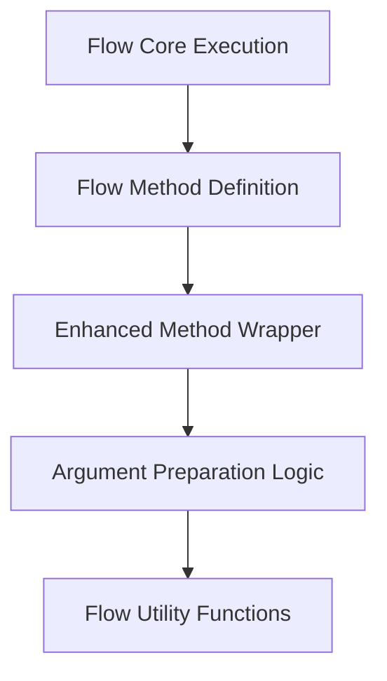

# `flow_method_enhancements` Module Documentation

## Introduction

The `flow_method_enhancements` module is a crucial component within the `crewai_flow_management` system, specifically responsible for enhancing the execution of methods defined within a flow. It provides mechanisms to preprocess arguments and inject necessary context before an original method is invoked, ensuring consistent and robust method execution across the CrewAI framework.

This module plays a vital role in maintaining the integrity and adaptability of flow methods by acting as an intermediary wrapper that prepares the execution environment for each method call.

## Architecture and Component Relationships

This module primarily consists of the `enhanced_method` component, which acts as a wrapper. It relies on an internal argument preparation logic (represented by `prepare_kwargs` in the code snippet) and integrates closely with its parent module, `flow_method_definition`, which defines how methods are structured and managed within the flow.

It also has indirect dependencies on `flow_core` for overall flow execution and potentially `flow_utils` for common utility functions used in argument preparation.

<!-- DIAGRAM_JSON
{
    "direction": "TD",
    "nodes": [
        {"id": "enhanced_method", "label": "Enhanced Method Wrapper", "type": "component", "link": null},
        {"id": "arg_preparation", "label": "Argument Preparation Logic", "type": "component", "link": null},
        {"id": "flow_method_definition", "label": "Flow Method Definition", "type": "external", "link": "flow_method_definition.md"},
        {"id": "flow_core", "label": "Flow Core Execution", "type": "external", "link": "flow_core.md"},
        {"id": "flow_utils", "label": "Flow Utility Functions", "type": "external", "link": "flow_utils.md"}
    ],
    "edges": [
        {"source": "enhanced_method", "target": "arg_preparation"},
        {"source": "arg_preparation", "target": "flow_utils"},
        {"source": "flow_method_definition", "target": "enhanced_method"},
        {"source": "flow_core", "target": "flow_method_definition"}
    ],
    "groups": []
}
-->



### Core Components

#### `enhanced_method`

-   **File:** `lib/crewai/src/crewai/flow/flow.py`
-   **Code Snippet:**
    ```python
                def enhanced_method(*args: Any, **kwargs: Any) -> Any:  # type: ignore[misc]
                    args, kwargs = prepare_kwargs(*args, **kwargs)
                    return original_method(*args, **kwargs)
    ```
-   **Description:** This function serves as a decorator or wrapper for original methods within a CrewAI flow. Before executing the `original_method`, it invokes `prepare_kwargs` to process and potentially modify the input arguments (`args` and `kwargs`). This ensures that all methods adhere to a consistent argument structure or receive necessary flow-specific context, such as current state or execution environment details.

## How it Fits into the Overall System

The `flow_method_enhancements` module is an integral part of the `crewai_flow_management` system, specifically nested under `flow_method_definition`. It provides a standardized way to preprocess method calls, which is essential for managing the complexity of dynamic agentic flows.

By centralizing argument preparation, it enables features like automatic state injection, context propagation, and validation, ensuring that methods operate within the correct flow context. This contributes to the overall robustness, maintainability, and extensibility of CrewAI's flow capabilities by abstracting away common setup logic from individual flow methods.

It ensures that the broader [flow_core](flow_core.md) execution engine always interacts with properly prepared methods, making the entire flow system more reliable and easier to develop against. Its utilities, such as [flow_utils](flow_utils.md), provide reusable logic that further streamlines the development of enhanced flow methods.