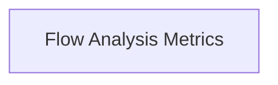

# Flow Metrics and Hierarchy Module

## Introduction

The `flow_metrics_and_hierarchy` module, part of `crewai_flow_management`, is responsible for analyzing the structure and hierarchy of execution flows within the CrewAI framework. It provides utilities to understand the complexity and relationships between different nodes (methods, listeners, routers) in a flow graph.

## Architecture Overview

This module primarily focuses on two key aspects: calculating hierarchical levels of flow nodes and counting outgoing edges to understand node connectivity.

<!-- DIAGRAM_JSON
{
    "direction": "TD",
    "nodes": [
        {"id": "flow_analysis_metrics", "label": "Flow Analysis Metrics", "type": "module", "link": "flow_analysis_metrics.md"}
    ],
    "edges": [],
    "groups": []
}
-->

## Sub-modules

### [Flow Analysis Metrics](flow_analysis_metrics.md)
This sub-module contains the core logic for calculating node levels and counting outgoing edges, providing foundational metrics for flow analysis.