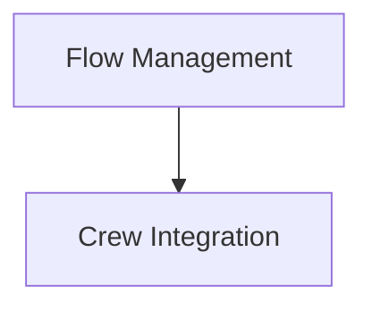

# Flow Orchestration Module Documentation

## Introduction

The `flow_orchestration` module provides the command-line interface (CLI) functionalities to manage the lifecycle and interaction with AI-driven flows within the CrewAI framework. It enables users to run, visualize, and integrate crews into existing flows, streamlining the development and deployment of complex AI workflows.

## Architecture Overview

The `flow_orchestration` module is structured into key sub-modules that handle specific aspects of flow management and crew integration. It relies on core components from `crewai_flow_management` for the actual flow execution and plotting, and integrates with other CrewAI components for crew functionality.

<!-- DIAGRAM_JSON
{
    "direction": "TD",
    "nodes": [
        {"id": "flow_management", "label": "Flow Management", "type": "module", "link": "flow_management.md"},
        {"id": "crew_integration", "label": "Crew Integration", "type": "module", "link": "crew_integration.md"}
    ],
    "edges": [
        {"source": "flow_management", "target": "crew_integration"}
    ],
    "groups": []
}
-->

## Sub-modules

### [Flow Management](flow_management.md)
This sub-module is responsible for initiating and visualizing AI flows. It provides commands to kick off a flow's execution and generate graphical representations of its structure and progress.

### [Crew Integration](crew_integration.md)
This sub-module handles the process of adding new crews to an already defined AI flow, facilitating modularity and expansion of AI systems.
