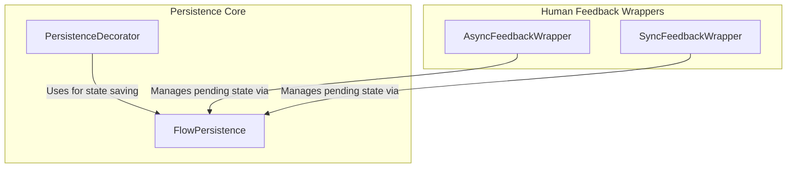

# flow_persistence
Provides an abstract interface for persisting flow states and includes decorators and wrappers for managing state persistence and human feedback interactions within a flow.

<!-- DIAGRAM_JSON
{
  "nodes": [
    {
      "id": "FlowPersistence",
      "label": "FlowPersistence",
      "description": "Abstract base class for flow state persistence, defining save/load methods and optional pending feedback handling."
    },
    {
      "id": "PersistenceDecorator",
      "label": "PersistenceDecorator",
      "description": "Decorator that wraps flow classes and methods to automatically persist state after execution."
    },
    {
      "id": "AsyncFeedbackWrapper",
      "label": "AsyncFeedbackWrapper",
      "description": "Asynchronous wrapper for methods requiring human feedback, handling pre-review, feedback request, and lesson distillation."
    },
    {
      "id": "SyncFeedbackWrapper",
      "label": "SyncFeedbackWrapper",
      "description": "Synchronous wrapper for methods requiring human feedback, handling pre-review, feedback request, and lesson distillation."
    }
  ],
  "edges": [
    {
      "source": "PersistenceDecorator",
      "target": "FlowPersistence",
      "label": "Uses for state saving"
    },
    {
      "source": "AsyncFeedbackWrapper",
      "target": "FlowPersistence",
      "label": "Manages pending state via"
    },
    {
      "source": "SyncFeedbackWrapper",
      "target": "FlowPersistence",
      "label": "Manages pending state via"
    }
  ],
  "groups": [
    {
      "id": "Persistence Core",
      "label": "Persistence Core",
      "nodes": ["FlowPersistence", "PersistenceDecorator"]
    },
    {
      "id": "Human Feedback Wrappers",
      "label": "Human Feedback Wrappers",
      "nodes": ["AsyncFeedbackWrapper", "SyncFeedbackWrapper"]
    }
  ]
}
-->
