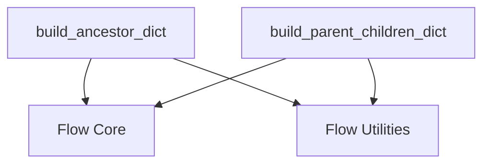

# Flow Relationship Builders Module

This module is responsible for building and analyzing the structural relationships within a given CrewAI flow. It provides utilities to understand the hierarchical connections between different nodes (methods, listeners, routers) in a flow, which is crucial for tasks like dependency analysis, visualization, and validation.

## Core Functionality

The `flow_relationship_builders` module contains key functions for mapping out the intricate relationships within a flow:

### `build_ancestor_dict`

This function constructs a dictionary that maps each node (method) in the flow to a set of all its ancestor nodes. This is useful for understanding the lineage and dependencies of any given node within the flow's execution path.

**Parameters:**
- `flow`: The flow instance to be analyzed.

**Returns:**
- `Dict[str, Set[str]]`: A dictionary where keys are node names and values are sets of their ancestor node names.

### `build_parent_children_dict`

This function creates a dictionary that outlines the direct parent-child relationships within the flow. It identifies how listeners are triggered by specific methods and how router methods dictate paths to other listeners. This provides a clear view of the immediate execution dependencies.

**Parameters:**
- `flow`: The flow instance to be analyzed.

**Returns:**
- `Dict[str, List[str]]`: A dictionary where keys are parent method names and values are lists of their immediate child method names.

## Architecture and Component Relationships

The `flow_relationship_builders` module is a sub-module of `flow_structure_utilities`, which in turn is part of `flow_graph_analysis` within `flow_utils`. It relies on the internal structure of the `flow` object, typically managed by the [flow_core](flow_core.md) module.

<!-- DIAGRAM_JSON
{
    "direction": "TD",
    "nodes": [
        {"id": "build_ancestor_dict", "label": "build_ancestor_dict", "type": "component", "link": null},
        {"id": "build_parent_children_dict", "label": "build_parent_children_dict", "type": "component", "link": null},
        {"id": "flow_core", "label": "Flow Core", "type": "external", "link": "flow_core.md"},
        {"id": "flow_utils", "label": "Flow Utilities", "type": "external", "link": "flow_utils.md"}
    ],
    "edges": [
        {"source": "build_ancestor_dict", "target": "flow_core"},
        {"source": "build_parent_children_dict", "target": "flow_core"},
        {"source": "build_ancestor_dict", "target": "flow_utils"},
        {"source": "build_parent_children_dict", "target": "flow_utils"}
    ],
    "groups": []
}
-->

## How it Fits into the Overall System

This module plays a vital role in the `crewai_flow_management` system by providing the foundational tools for understanding and interpreting the structure of complex agent flows. The relationship dictionaries built by this module are used by other components within `flow_graph_analysis` and `flow_utils` for tasks such as:

- **Flow Visualization:** Generating graphical representations of the flow.
- **Dependency Checking:** Identifying potential circular dependencies or unreachable nodes.
- **Metric Calculation:** Deriving metrics related to flow complexity and hierarchy.
- **Debugging and Analysis:** Aiding developers in tracing execution paths and understanding flow behavior.