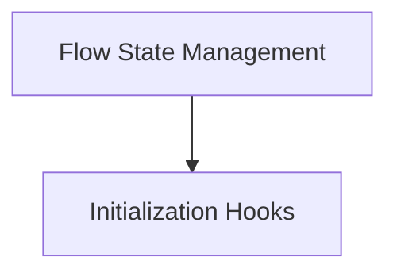

# Flow State Module Documentation

## Introduction
The `flow_state` module is a critical component within the `crewai.flow` management system, responsible for defining, managing, and restoring the state of a flow. It provides mechanisms for agents to interact with the current state and ensures that flow execution can be seamlessly resumed from a persistent state.

## Architecture Overview
The `flow_state` module is composed of two main sub-modules: `state_management` and `initialization_hooks`. The `state_management` sub-module handles the core logic for accessing and restoring the flow's state, while `initialization_hooks` deals with the setup procedures when a flow model is initialized.

### Sub-modules:
-   **[Flow State Management](state_management.md)**: This sub-module is responsible for the intricate details of retrieving and restoring the state of an ongoing flow. It supports both dictionary-based and Pydantic BaseModel states, providing flexibility in how flow data is structured and persisted.
-   **[Initialization Hooks](initialization_hooks.md)**: This sub-module manages the execution of post-initialization routines for flow models, ensuring that any necessary setup or validation is performed immediately after a flow's state model is created or loaded.

<!-- DIAGRAM_JSON
{
    "direction": "TD",
    "nodes": [
        {"id": "state_management", "label": "Flow State Management", "type": "module", "link": "state_management.md"},
        {"id": "initialization_hooks", "label": "Initialization Hooks", "type": "module", "link": "initialization_hooks.md"}
    ],
    "edges": [
        {"source": "state_management", "target": "initialization_hooks"}
    ],
    "groups": []
}
-->

