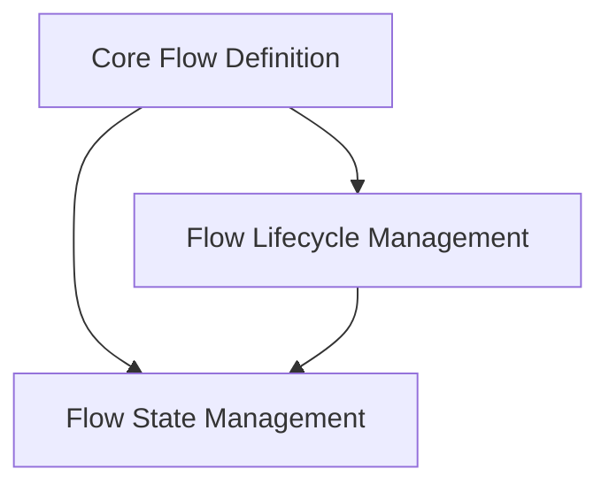

# Flow State and Lifecycle

This module, `flow_state_and_lifecycle`, is a critical component within the [flow_core.md](flow_core.md) module, which itself is part of the larger [crewai_flow_management.md](crewai_flow_management.md) system. It focuses on defining the core structure of a Flow, along with managing its execution lifecycle and persistent state.

## Purpose and Core Functionality

The primary purpose of this module is to provide the foundational `Flow` class and the mechanisms to control its execution flow, including starting, resuming, and reloading. It also handles the intricate details of managing the flow's internal state, ensuring data consistency and persistence across different stages of execution or even across pauses and resumptions.

## Architecture Overview

The `flow_state_and_lifecycle` module is structured into three main sub-modules:

1.  **[Core Flow Definition](flow_core_definition.md)**: Encapsulates the fundamental `Flow` class, which serves as the blueprint for all flows.
2.  **[Flow Lifecycle Management](flow_lifecycle.md)**: Contains methods responsible for initiating, advancing, pausing, and resuming the execution of a flow.
3.  **[Flow State Management](flow_state.md)**: Deals with the creation, access, and restoration of the flow's dynamic state.

These sub-modules interact to provide a robust and flexible framework for defining and executing complex multi-agent workflows.

<!-- DIAGRAM_JSON
{
    "direction": "TD",
    "nodes": [
        {"id": "flow_core_definition", "label": "Core Flow Definition", "type": "module", "link": "flow_core_definition.md"},
        {"id": "flow_lifecycle", "label": "Flow Lifecycle Management", "type": "module", "link": "flow_lifecycle.md"},
        {"id": "flow_state", "label": "Flow State Management", "type": "module", "link": "flow_state.md"}
    ],
    "edges": [
        {"source": "flow_core_definition", "target": "flow_lifecycle"},
        {"source": "flow_core_definition", "target": "flow_state"},
        {"source": "flow_lifecycle", "target": "flow_state"}
    ],
    "groups": []
}
-->

## Sub-module Functionality

### Core Flow Definition

This sub-module defines the fundamental `Flow` class, which all flows in the system inherit from. It sets up the basic structure, properties, and internal mechanisms necessary for a flow to operate, including its configuration, event handling, and memory management.

### Flow Lifecycle Management

This sub-module provides the necessary methods to control the execution flow of a `Flow` instance. It includes functionalities for:

*   **`resume` and `from_pending`**: Handling the continuation of a flow after it has been paused, typically for human feedback.
*   **`reload`**: Restoring a flow's execution state from previously stored data.
*   **`run_flow` and `_run_flow`**: Initiating and managing the asynchronous execution of the flow's methods.

### Flow State Management

This sub-module is responsible for the persistent and dynamic aspects of a flow's state. Key functionalities include:

*   **`state`**: Providing a thread-safe proxy for accessing the current state of the flow.
*   **`_restore_state`**: Reconstructing the flow's state from a given dictionary, typically during a reload or resumption.
*   **`model_post_init`**: Handling the initial setup and configuration of the flow's state upon instantiation.

## Relationship to Overall System

This module serves as the core engine for defining and managing the execution of complex workflows within the CrewAI framework. It underpins how agents interact and progress through a series of tasks, especially in scenarios requiring human intervention or persistence. It heavily relies on the [crewai_flow_management.md](crewai_flow_management.md) for overall flow orchestration and interacts with other modules for aspects like event handling ([crewai_event_system.md](crewai_event_system.md)) and persistence (through its own `FlowPersistence` abstraction). The state management aspects ensure that workflows can be robustly paused, resumed, and inspected, making them suitable for long-running or interactive applications.