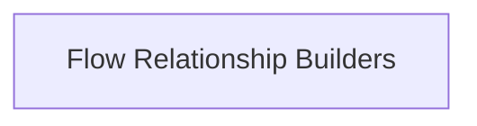

# Flow Structure Utilities

## Introduction and Purpose
The `flow_structure_utilities` module provides essential tools for analyzing and understanding the internal structure of flows within the CrewAI framework. It offers functionalities to map relationships between different components (methods, listeners, routers) of a flow, facilitating debugging, visualization, and dynamic management.

## Architecture Overview
This module currently consists of a single sub-module, `flow_relationship_builders`, which is responsible for constructing various hierarchical views of a flow. These builders parse the flow's internal state to identify and record parent-child and ancestor relationships, crucial for comprehending the execution path and dependencies within complex flows.

## High-Level Functionality of Sub-modules

*   **[Flow Relationship Builders](flow_relationship_builders.md)**: This sub-module contains the core logic for generating dictionaries that map the structural relationships within a flow, such as parent-children and ancestors.

<!-- DIAGRAM_JSON
{
    "direction": "TD",
    "nodes": [
        {"id": "flow_relationship_builders", "label": "Flow Relationship Builders", "type": "module", "link": "flow_relationship_builders.md"}
    ],
    "edges": [],
    "groups": []
}
-->

