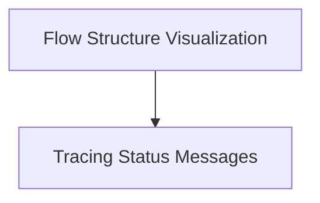

# Flow Utility and Tracing Module

## Introduction

The `flow_utility_and_tracing` module provides essential tools for understanding and debugging the execution flow within the system. It encompasses functionalities for visualizing the flow's structure and providing informative messages about tracing status.

## Architecture Overview

This module is composed of two main sub-modules:

1.  **Flow Visualization Utility**: Handles the generation of interactive diagrams representing the flow.
2.  **Tracing Messages**: Manages and displays messages related to the system's tracing capabilities.

These sub-modules work together to offer insights into the flow's operation, aiding developers in monitoring and debugging.

<!-- DIAGRAM_JSON
{
    "direction": "TD",
    "nodes": [
        {"id": "flow_visualization_utility", "label": "Flow Structure Visualization", "type": "module", "link": "flow_visualization_utility.md"},
        {"id": "tracing_messages", "label": "Tracing Status Messages", "type": "module", "link": "tracing_messages.md"}
    ],
    "edges": [
        {"source": "flow_visualization_utility", "target": "tracing_messages"}
    ],
    "groups": []
}
-->

## Sub-modules

### [Flow Structure Visualization](flow_visualization_utility.md)

This sub-module is responsible for generating interactive HTML visualizations of the Flow's structure. It helps developers to visually understand the complex relationships and execution paths within a flow.

### [Tracing Status Messages](tracing_messages.md)

The `tracing_messages` sub-module handles the display of informational messages regarding the state of the system's tracing functionality. It provides users with clear guidance on how to enable or disable tracing, enhancing the debuggability of the system.