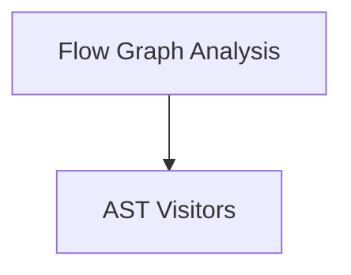

# Flow Utilities Module

The `flow_utils` module provides a collection of utility functions and AST visitors crucial for analyzing, managing, and visualizing the structure and execution flow of CrewAI flows. It helps in understanding node relationships, hierarchical levels, and extracting relevant information directly from method code.

## Architecture Overview

The `flow_utils` module is composed of two primary sub-modules:

1.  **Flow Graph Analysis**: Focuses on algorithms and functions for traversing and understanding the flow's graph structure.
2.  **AST Visitors**: Contains specialized visitors for Abstract Syntax Tree (AST) manipulation to extract specific data from flow method implementations.

<!-- DIAGRAM_JSON
{
    "direction": "TD",
    "nodes": [
        {"id": "flow_graph_analysis", "label": "Flow Graph Analysis", "type": "module", "link": "flow_graph_analysis.md"},
        {"id": "ast_visitors", "label": "AST Visitors", "type": "module", "link": "ast_visitors.md"}
    ],
    "edges": [
        {"source": "flow_graph_analysis", "target": "ast_visitors"}
    ],
    "groups": []
}
-->

## Sub-modules

### [Flow Graph Analysis](flow_graph_analysis.md)
This sub-module provides core functionalities for analyzing the graphical structure of a CrewAI flow. It includes functions to build ancestor dictionaries, calculate hierarchical levels of nodes, and count outgoing edges, which are essential for understanding flow dependencies and execution order.

### [AST Visitors](ast_visitors.md)
This sub-module houses AST (Abstract Syntax Tree) visitor classes designed to parse and extract specific information from the code of flow methods. These visitors are used to identify return values, variable assignments, and comparisons involving state attributes, aiding in static analysis of flow logic.