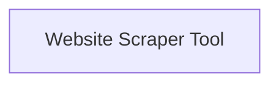

# Full Website Scraping Module

The `full_website_scraping` module provides the core tools for comprehensively scraping content from websites. It includes functionalities to fetch and parse entire web pages, extracting their textual content for further processing.

## Architecture

The module's architecture is straightforward, focusing on a single, powerful tool for web scraping. The primary component is the Website Scraper Tool, which encapsulates the logic for HTTP requests, HTML parsing, and text extraction.

<!-- DIAGRAM_JSON
{
    "direction": "TD",
    "nodes": [
        {"id": "website_scraper_tool", "label": "Website Scraper Tool", "type": "module", "link": "website_scraper_tool.md"}
    ],
    "edges": [],
    "groups": []
}
-->

## Sub-modules

### [Website Scraper Tool](website_scraper_tool.md)
This sub-module contains the `ScrapeWebsiteTool` and its associated `ScrapeWebsiteToolSchema`, enabling the scraping of full website content. It handles the retrieval of web pages, parsing the HTML, and extracting clean text.