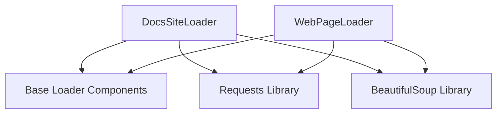

# general_web_content_loaders

## Introduction
The `general_web_content_loaders` module, part of the `crewai_tools` library, provides essential functionalities for extracting and loading content from various web sources. It includes specialized loaders for general web pages and documentation sites, making it a crucial component for RAG (Retrieval Augmented Generation) systems that need to ingest information from the internet.

## Architecture and Core Functionality

The `general_web_content_loaders` module consists of two primary components, each designed for a specific type of web content retrieval:

### 1. DocsSiteLoader
The `DocsSiteLoader` is tailored for extracting content from documentation websites. It intelligently parses the HTML structure to identify main content areas, titles, and even a table of contents, ensuring that relevant information is extracted efficiently. It also attempts to identify and list related documentation pages, providing a more comprehensive context.

**Key Features:**
*   **Targeted Extraction:** Focuses on common documentation site structures to extract core content.
*   **Table of Contents Generation:** Attempts to reconstruct a table of contents from headings.
*   **Related Links Discovery:** Identifies and lists internal navigation links as related pages.
*   **Content Truncation:** Prevents excessively large documents by truncating content.

### 2. WebPageLoader
The `WebPageLoader` is a more general-purpose tool for loading content from any standard web page. It focuses on extracting the clean, readable text content, stripping away irrelevant elements like scripts and styles, and normalizing whitespace for better readability.

**Key Features:**
*   **General Web Scraping:** Capable of fetching and parsing content from any valid URL.
*   **Text Cleaning:** Removes boilerplate code (scripts, styles) and normalizes text.
*   **Metadata Extraction:** Gathers useful metadata such as URL, title, HTTP status, and content type.

## Module Relationships

This module resides within the `web_loaders` sub-module, which is part of the broader `data_loaders` module. The `data_loaders` module, in turn, is a key component of `crewai_tools_rag_loaders_and_chunkers`, indicating its role in providing data to RAG systems. Both `DocsSiteLoader` and `WebPageLoader` depend on base components like `BaseLoader`, `SourceContent`, and `LoaderResult`, which are defined in [base_components.md](base_components.md) within `crewai_tools_rag_loaders_and_chunkers`. They also leverage external libraries such as `requests` for HTTP communication and `BeautifulSoup` for HTML parsing.

<!-- DIAGRAM_JSON
{
    "direction": "TD",
    "nodes": [
        {"id": "docs_site_loader", "label": "DocsSiteLoader", "type": "component", "link": null},
        {"id": "webpage_loader", "label": "WebPageLoader", "type": "component", "link": null},
        {"id": "base_loader_components", "label": "Base Loader Components", "type": "external", "link": "base_components.md"},
        {"id": "requests_library", "label": "Requests Library", "type": "external", "link": null},
        {"id": "beautiful_soup_library", "label": "BeautifulSoup Library", "type": "external", "link": null}
    ],
    "edges": [
        {"source": "docs_site_loader", "target": "base_loader_components"},
        {"source": "docs_site_loader", "target": "requests_library"},
        {"source": "docs_site_loader", "target": "beautiful_soup_library"},
        {"source": "webpage_loader", "target": "base_loader_components"},
        {"source": "webpage_loader", "target": "requests_library"},
        {"source": "webpage_loader", "target": "beautiful_soup_library"}
    ],
    "groups": []
}
-->

