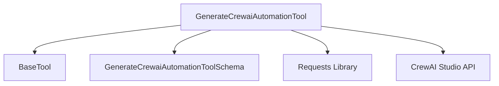

# `generate_crewai_automation_tool`

The `generate_crewai_automation_tool` module provides a specialized tool for interacting with the CrewAI Studio API. It enables the automatic generation of complete CrewAI automations from natural language descriptions, streamlining the process of creating AI-driven workflows.

## Core Functionality

This module's primary function is to offer a programmatic interface for creating CrewAI projects in CrewAI Studio. It abstracts away the complexities of API calls, allowing users to define their automation requirements in natural language and receive a direct URL to their newly generated project.

## Architecture and Component Relationships

The `generate_crewai_automation_tool` module contains a single core component, `GenerateCrewaiAutomationTool`, which inherits from `BaseTool` (from the [crewai_tool_base](crewai_tool_base.md) module). This tool uses external libraries like `requests` for making HTTP calls to the CrewAI Studio API.

<!-- DIAGRAM_JSON
{
    "direction": "TD",
    "nodes": [
        {"id": "generate_crewai_automation_tool", "label": "GenerateCrewaiAutomationTool", "type": "component", "link": null},
        {"id": "generate_crewai_automation_tool_schema", "label": "GenerateCrewaiAutomationToolSchema", "type": "component", "link": null},
        {"id": "base_tool", "label": "BaseTool", "type": "external", "link": "crewai_tool_base.md"},
        {"id": "requests_library", "label": "Requests Library", "type": "external", "link": null},
        {"id": "crewai_studio_api", "label": "CrewAI Studio API", "type": "external", "link": null}
    ],
    "edges": [
        {"source": "generate_crewai_automation_tool", "target": "base_tool"},
        {"source": "generate_crewai_automation_tool", "target": "generate_crewai_automation_tool_schema"},
        {"source": "generate_crewai_automation_tool", "target": "requests_library"},
        {"source": "generate_crewai_automation_tool", "target": "crewai_studio_api"}
    ],
    "groups": []
}
-->

### `GenerateCrewaiAutomationTool`

`GenerateCrewaiAutomationTool` is the main class within this module, designed to create CrewAI automations. It serves as an interface to the CrewAI Studio API, allowing users to provision new projects through natural language prompts.

**Key Attributes:**

*   `name`: A descriptive name for the tool ("Generate CrewAI Automation").
*   `description`: Explains the tool's purpose: leveraging CrewAI Studio to generate automations from natural language.
*   `args_schema`: Specifies the input schema for the tool, typically including a `prompt` for the automation description and an optional `organization_id`.
*   `crewai_enterprise_url`: The base URL for the CrewAI AMP API. Defaults to `https://app.crewai.com` or can be set via the `CREWAI_PLUS_URL` environment variable.
*   `personal_access_token`: The user's Personal Access Token for authentication with the CrewAI AMP API. Loaded from the `CREWAI_PERSONAL_ACCESS_TOKEN` environment variable.
*   `env_vars`: A list of `EnvVar` objects detailing the environment variables used by the tool, their descriptions, and whether they are required.

**Key Methods:**

*   `_run(**kwargs: Any) -> str`:
    *   This method is invoked when the tool is executed.
    *   It takes keyword arguments, validates them against `GenerateCrewaiAutomationToolSchema`.
    *   Constructs and sends a POST request to the CrewAI Studio API endpoint (`/crewai_plus/api/v1/studio`).
    *   Includes the natural language `prompt` from the input in the request body.
    *   Utilizes `_get_headers` to include necessary authentication and organization ID in the request headers.
    *   Returns the URL of the newly generated CrewAI Studio project.

*   `_get_headers(organization_id: str | None = None) -> dict[str, str]`:
    *   A helper method responsible for generating the HTTP headers required for API requests.
    *   Includes an `Authorization` header with the `personal_access_token` as a Bearer token.
    *   Sets `Content-Type` and `Accept` headers to `application/json`.
    *   Optionally adds an `X-Crewai-Organization-Id` header if an `organization_id` is provided.

## How it Fits into the Overall System

This module integrates into the broader CrewAI ecosystem as a powerful [platform_automation](crewai_tools_platform_automation.md) tool. It extends the capabilities of CrewAI agents by allowing them to dynamically create and manage CrewAI projects within CrewAI Studio. This facilitates rapid prototyping, deployment, and scaling of AI automations directly from an agent's workflow.

It depends on the [crewai_tool_base](crewai_tool_base.md) module for its foundational `BaseTool` class, ensuring consistency and adherence to the CrewAI tool interface. It also implicitly relies on external HTTP client libraries (like `requests`) to communicate with the CrewAI Studio platform.