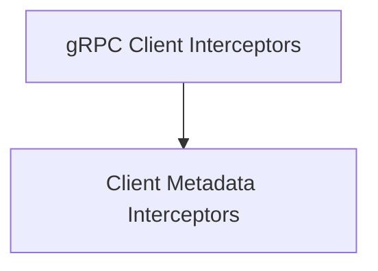

# gRPC Client Interceptors

## Introduction and Purpose
The `grpc_client_interceptors` module provides core client-side interceptors for gRPC calls within the Agent-to-Agent (A2A) communication framework. These interceptors are crucial for injecting necessary metadata, such as authentication tokens, into outgoing gRPC requests, ensuring secure and properly attributed communication between agents.

## Architecture Overview
This module is a specialized component within the broader [a2a_delegation_utils](a2a_delegation_utils.md) which orchestrates secure communication and delegation. Specifically, `grpc_client_interceptors` is a child of the `grpc_interceptors` module and focuses on modifying gRPC client call details by injecting metadata.

<!-- DIAGRAM_JSON
{
    "direction": "TD",
    "nodes": [
        {"id": "client_metadata_interceptors", "label": "Client Metadata Interceptors", "type": "module", "link": "client_metadata_interceptors.md"}
    ],
    "edges": [
        {"source": "grpc_client_interceptors_main", "target": "client_metadata_interceptors"}
    ],
    "groups": []
}
-->

## High-Level Functionality

### Client Metadata Interceptors
This sub-module contains the specific implementations for intercepting different types of gRPC client calls (unary-unary, unary-stream, stream-unary, and stream-stream) to inject metadata consistently across all communication patterns. This ensures that every outgoing request carries the required authentication and contextual information.

For more detailed information, refer to the [Client Metadata Interceptors documentation](client_metadata_interceptors.md).