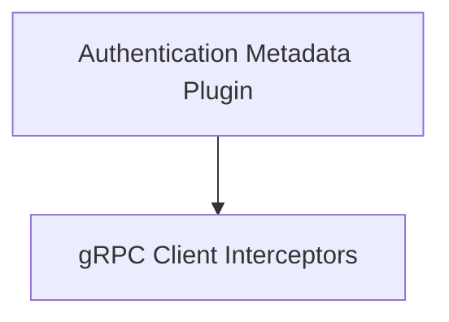

# gRPC Interceptors Module

## Introduction
The `grpc_interceptors` module provides core functionalities for injecting authentication metadata into gRPC client calls within the Agent-to-Agent (A2A) communication framework. It ensures secure and properly attributed inter-agent communication by intercepting gRPC requests and attaching necessary authentication headers.

## Architecture Overview
This module comprises an authentication metadata plugin and several gRPC client interceptors. The `auth_metadata_plugin` generates the required authentication metadata, which is then utilized by the `grpc_client_interceptors` to inject into various types of gRPC calls (unary-unary, unary-stream, stream-unary, stream-stream). This modular design allows for flexible and consistent handling of authentication across different gRPC communication patterns.

The `grpc_interceptors` module is a crucial part of the [a2a_delegation_utils](a2a_delegation_utils.md) which itself is nested under `crewai_agent_to_agent_communication` module, highlighting its role in securing inter-agent delegation.

## High-level functionality of each sub-module:

*   **[Authentication Metadata Plugin](auth_metadata_plugin.md)**: This sub-module contains the `AuthMetadataPlugin` class, which is responsible for dynamically providing authentication headers as gRPC metadata.
*   **[gRPC Client Interceptors](grpc_client_interceptors.md)**: This sub-module provides various client-side gRPC interceptors (`MetadataUnaryUnary`, `MetadataUnaryStream`, `MetadataStreamUnary`, `MetadataStreamStream`) that transparently inject the authentication metadata generated by the `AuthMetadataPlugin` into outgoing gRPC requests.

<!-- DIAGRAM_JSON
{
    "direction": "TD",
    "nodes": [
        {"id": "auth_metadata_plugin", "label": "Authentication Metadata Plugin", "type": "module", "link": "auth_metadata_plugin.md"},
        {"id": "grpc_client_interceptors", "label": "gRPC Client Interceptors", "type": "module", "link": "grpc_client_interceptors.md"}
    ],
    "edges": [
        {"source": "auth_metadata_plugin", "target": "grpc_client_interceptors"}
    ],
    "groups": []
}
-->

