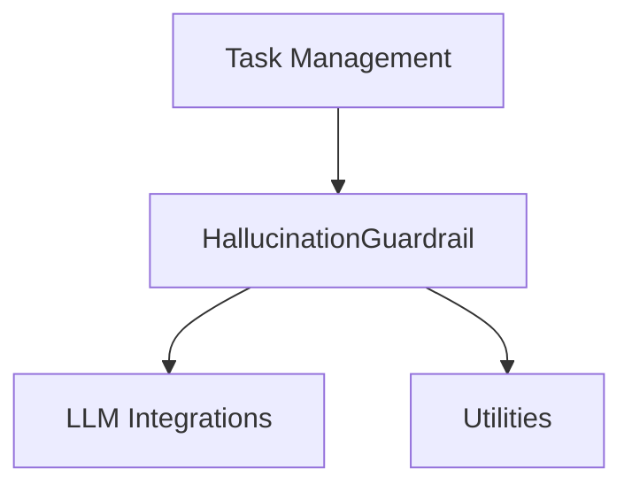

# Hallucination Prevention Module

## Introduction
The `hallucination_prevention` module is a critical component within the CrewAI framework, designed to mitigate AI hallucinations by validating task outputs against specified contexts and thresholds. Currently, in its open-source version, this module serves as a placeholder, signaling its premium capabilities through warnings about its enhanced features available on the CrewAI platform.

## Purpose and Core Functionality
The primary purpose of the `hallucination_prevention` module is to ensure the factual accuracy and reliability of AI-generated content. It achieves this through the `HallucinationGuardrail` class, which is intended to evaluate task outputs from agents.

### `HallucinationGuardrail` Class
This class is the core component of the module. While currently acting as a "no-op" in the open-source version, its design provides a clear interface for future advanced hallucination detection. Key aspects include:

-   **Context-based Validation**: It can take an optional `context` string, against which the AI's output will be checked for faithfulness. If no context is provided, it defaults to using the task's `expected_output`.
-   **LLM-Powered Evaluation**: An `llm` (Language Model) is supplied to the guardrail for performing the actual evaluation of the output against the context.
-   **Thresholding**: An optional `threshold` allows for setting a minimum faithfulness score required for an output to pass validation, enabling stricter control over output quality.
-   **Tool Response Integration**: It can incorporate `tool_response` information, providing additional context for more nuanced evaluation.

In its current state, the `__call__` method of `HallucinationGuardrail` logs a warning about its premium nature and always returns `True`, effectively allowing all outputs to pass without actual validation.

## Architecture and Component Relationships

The `hallucination_prevention` module is a sub-module of `crewai_task_management` and primarily revolves around the `HallucinationGuardrail` component. It interacts with other modules for its functionality.

<!-- DIAGRAM_JSON
{
    "direction": "TD",
    "nodes": [
        {"id": "hallucination_guardrail", "label": "HallucinationGuardrail", "type": "component", "link": null},
        {"id": "llm_integrations", "label": "LLM Integrations", "type": "external", "link": "crewai_llm_integrations.md"},
        {"id": "task_management", "label": "Task Management", "type": "external", "link": "crewai_task_management.md"},
        {"id": "utilities", "label": "Utilities", "type": "external", "link": "crewai_utilities.md"}
    ],
    "edges": [
        {"source": "hallucination_guardrail", "target": "llm_integrations"},
        {"source": "hallucination_guardrail", "target": "utilities"},
        {"source": "task_management", "target": "hallucination_guardrail"}
    ],
    "groups": []
}
-->


**Component Breakdown:**

-   **`HallucinationGuardrail`**: The central class responsible for defining and managing the hallucination prevention logic.
-   **`LLM Integrations`**: The `HallucinationGuardrail` depends on an LLM for its evaluation process. This dependency is satisfied by components within the [crewai_llm_integrations](crewai_llm_integrations.md) module.
-   **`Task Management`**: As a sub-module, `hallucination_prevention` is intrinsically linked to the [crewai_task_management](crewai_task_management.md) module, which orchestrates how tasks are executed and validated.
-   **`Utilities`**: The module utilizes logging functionalities, likely provided by a utility module such as [crewai_utilities](crewai_utilities.md).

## How the Module Fits into the Overall System
The `hallucination_prevention` module is strategically placed within the `crewai_task_management` framework. Its integration ensures that outputs generated by agents during task execution can be subjected to a crucial quality control step. Although currently a placeholder, its future role is to act as a gatekeeper, preventing unfaithful or fabricated information from being propagated through the system.

By providing a mechanism to check AI outputs against reliable sources and defined criteria, this module contributes significantly to the overall trustworthiness and robustness of AI agents within CrewAI, ultimately aiming to enhance the reliability of autonomous workflows.

```python
class HallucinationGuardrail:
    """Placeholder for the HallucinationGuardrail feature.

    Attributes:
        context: Optional reference context that outputs would be checked against.
        llm: The language model that would be used for evaluation.
        threshold: Optional minimum faithfulness score that would be required to pass.
        tool_response: Optional tool response information that would be used in evaluation.

    Examples:
        >>> # Basic usage without context (uses task expected_output as context)
        >>> guardrail = HallucinationGuardrail(llm=agent.llm)

        >>> # With context for reference
        >>> guardrail = HallucinationGuardrail(
        ...     llm=agent.llm,
        ...     context="AI helps with various tasks including analysis and generation.",
        ... )

        >>> # With custom threshold for stricter validation
        >>> strict_guardrail = HallucinationGuardrail(
        ...     llm=agent.llm,
        ...     threshold=8.0,  # Require score >= 8 to pass
        ... )

        >>> # With tool response for additional context
        >>> guardrail_with_tools = HallucinationGuardrail(
        ...     llm=agent.llm,
        ...     tool_response="Weather API returned: Temperature 22°C, Humidity 65%",
        ... )
    """

    def __init__(
        self,
        llm: LLM,
        context: str | None = None,
        threshold: float | None = None,
        tool_response: str = "",
    ):
        """Initialize the HallucinationGuardrail placeholder.

        Args:
            llm: The language model that would be used for evaluation.
            context: Optional reference context that outputs would be checked against.
                If not provided, the task's expected_output will be used as context.
            threshold: Optional minimum faithfulness score that would be required to pass.
            tool_response: Optional tool response information that would be used in evaluation.
        """
        self.context = context
        self.llm: LLM = llm
        self.threshold = threshold
        self.tool_response = tool_response
        self._logger = Logger(verbose=True)
        self._logger.log(
            "warning",
            """Hallucination detection is a no-op in open source, use it for free at https://app.crewai.com
""",
            color="red",
        )

    @property
    def description(self) -> str:
        """Generate a description of this guardrail for event logging."""
        return "HallucinationGuardrail (no-op)"

    def __call__(self, task_output: TaskOutput) -> tuple[bool, Any]:
        """Validate a task output against hallucination criteria.

        Args:
            task_output: The output to be validated.

        Returns:
            A tuple containing:
                - True if validation passed, False otherwise
                - The raw task output if valid, or error feedback if invalid
        """
        if callable(_validate_output_hook):
            return _validate_output_hook(self, task_output)

        self._logger.log(
            "warning",
            "Premium hallucination detection skipped (use for free at https://app.crewai.com)
",
            color="red",
        )
        return True, task_output.raw
```
