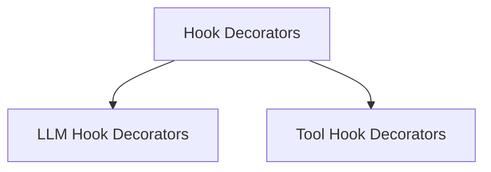

# Hook Decorators Module

## Introduction

The `hook_decorators` module in `crewai` provides a powerful and flexible way to inject custom logic before and after calls to Large Language Models (LLMs) and tools. By leveraging Python decorators, developers can easily register functions to intercept and modify the behavior of agents, enabling advanced functionalities like logging, sanitization, approval flows, and more.

This module is a core part of the `crewai.hooks_system`, allowing for fine-grained control over the execution flow within a CrewAI application.

## Architecture Overview

The `hook_decorators` module is designed to provide a simple API for registering callbacks that are triggered at specific points during the execution of LLM and tool calls. It works by integrating with the `crewai.hooks.llm_hooks` and `crewai.hooks.tool_hooks` modules, which manage the actual registration and execution of these callbacks.

Essentially, the decorators act as syntactic sugar to associate a user-defined function with a specific hook type (before/after LLM call, before/after tool call) and optional filters (agents or tools).

<!-- DIAGRAM_JSON
{
    "direction": "TD",
    "nodes": [
        {"id": "llm_hook_decorators", "label": "LLM Hook Decorators", "type": "module", "link": "llm_hook_decorators.md"},
        {"id": "tool_hook_decorators", "label": "Tool Hook Decorators", "type": "module", "link": "tool_hook_decorators.md"}
    ],
    "edges": [
        {"source": "hook_decorators", "target": "llm_hook_decorators"},
        {"source": "hook_decorators", "target": "tool_hook_decorators"}
    ],
    "groups": []
}
-->

## Sub-modules

### [LLM Hook Decorators](llm_hook_decorators.md)
Provides decorators for registering functions to be executed before or after LLM calls, allowing for custom logic and response manipulation.

### [Tool Hook Decorators](tool_hook_decorators.md)
Offers decorators to register functions that run before or after tool calls, enabling interception and modification of tool execution.