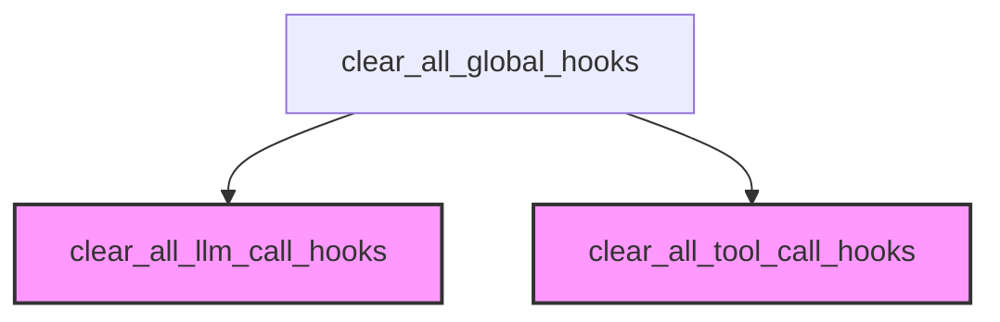

# Module: `hook_management`

## Introduction
The `hook_management` module provides a centralized utility for managing and clearing all registered global hooks within the CrewAI framework. It acts as a convenient interface to reset the state of both LLM (Large Language Model) and Tool call hooks, which are essential for controlling and observing the execution flow of agents and tools.

## Core Functionality

The primary component of this module is `clear_all_global_hooks`, which offers a straightforward way to remove all hooks, simplifying testing, state management, and cleanup operations.

### `clear_all_global_hooks`

This function is responsible for clearing all global LLM and Tool hooks. It delegates the actual clearing operation to specific functions for LLM and Tool hooks, and then returns a summary of the number of hooks cleared.

**Purpose:**
To provide a single point of entry for resetting the global hook system, ensuring a clean slate for new operations or during development/testing cycles.

**Parameters:**
None

**Returns:**
`dict[str, tuple[int, int]]` - A dictionary detailing the count of hooks before and after the clearing operation for LLM hooks, Tool hooks, and the total.
- `llm_hooks`: `(before_count, after_count)` - Tuple showing the number of LLM hooks before and after clearing.
- `tool_hooks`: `(before_count, after_count)` - Tuple showing the number of Tool hooks before and after clearing.
- `total`: `(total_before_count, total_after_count)` - Tuple showing the total number of hooks before and after clearing.

**Example:**
```python
# Register various hooks (assuming these functions are available)
# register_before_llm_call_hook(llm_hook1)
# register_after_llm_call_hook(llm_hook2)
# register_before_tool_call_hook(tool_hook1)
# register_after_tool_call_hook(tool_hook2)

# Clear all hooks at once
result = clear_all_global_hooks()
print(result)
# Expected output (example, actual counts depend on registered hooks):
# {
#     'llm_hooks': (1, 0),
#     'tool_hooks': (1, 0),
#     'total': (2, 0)
# }
```

## Architecture and Component Relationships

The `hook_management` module, specifically `clear_all_global_hooks`, relies on the underlying hook management functions provided by the broader [crewai_hooks_system.md](crewai_hooks_system.md). It orchestrates calls to clear LLM-specific and Tool-specific hooks, demonstrating a clear separation of concerns where the `hook_management` acts as an aggregator for cleanup operations.

<!-- DIAGRAM_JSON
{
    "direction": "TD",
    "nodes": [
        {"id": "clear_all_global_hooks", "label": "clear_all_global_hooks", "type": "component", "link": null},
        {"id": "clear_all_llm_call_hooks", "label": "clear_all_llm_call_hooks", "type": "external", "link": "crewai_hooks_system.md"},
        {"id": "clear_all_tool_call_hooks", "label": "clear_all_tool_call_hooks", "type": "external", "link": "crewai_hooks_system.md"}
    ],
    "edges": [
        {"source": "clear_all_global_hooks", "target": "clear_all_llm_call_hooks"},
        {"source": "clear_all_global_hooks", "target": "clear_all_tool_call_hooks"}
    ],
    "groups": []
}
-->
