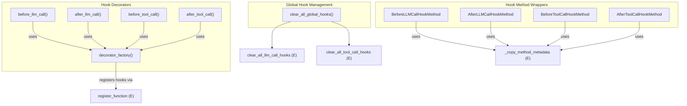

# hook_registration
This module provides a comprehensive system for registering and managing LLM and tool call hooks, offering decorators for global functions and wrapper classes for instance methods, alongside a utility to clear all registered hooks.

<!-- DIAGRAM_JSON
{
  "nodes": [
    {"id": "clear_all_global_hooks", "label": "clear_all_global_hooks", "type": "function"},
    {"id": "decorator_factory", "label": "decorator_factory", "type": "function"},
    {"id": "before_llm_call", "label": "before_llm_call", "type": "function"},
    {"id": "after_llm_call", "label": "after_llm_call", "type": "function"},
    {"id": "before_tool_call", "label": "before_tool_call", "type": "function"},
    {"id": "after_tool_call", "label": "after_tool_call", "type": "function"},
    {"id": "BeforeLLMCallHookMethod", "label": "BeforeLLMCallHookMethod", "type": "class"},
    {"id": "AfterLLMCallHookMethod", "label": "AfterLLMCallHookMethod", "type": "class"},
    {"id": "BeforeToolCallHookMethod", "label": "BeforeToolCallHookMethod", "type": "class"},
    {"id": "AfterToolCallHookMethod", "label": "AfterToolCallHookMethod", "type": "class"}
  ],
  "edges": [
    {"source": "clear_all_global_hooks", "target": "clear_all_llm_call_hooks", "label": "calls", "type": "external"},
    {"source": "clear_all_global_hooks", "target": "clear_all_tool_call_hooks", "label": "calls", "type": "external"},
    {"source": "before_llm_call", "target": "decorator_factory", "label": "uses"},
    {"source": "after_llm_call", "target": "decorator_factory", "label": "uses"},
    {"source": "before_tool_call", "target": "decorator_factory", "label": "uses"},
    {"source": "after_tool_call", "target": "decorator_factory", "label": "uses"},
    {"source": "decorator_factory", "target": "register_function", "label": "registers hooks via", "type": "external"},
    {"source": "BeforeLLMCallHookMethod", "target": "_copy_method_metadata", "label": "uses", "type": "external"},
    {"source": "AfterLLMCallHookMethod", "target": "_copy_method_metadata", "label": "uses", "type": "external"},
    {"source": "BeforeToolCallHookMethod", "target": "_copy_method_metadata", "label": "uses", "type": "external"},
    {"source": "AfterToolCallHookMethod", "target": "_copy_method_metadata", "label": "uses", "type": "external"}
  ],
  "groups": [
    {"id": "global_hook_management", "label": "Global Hook Management", "nodes": ["clear_all_global_hooks"]},
    {"id": "hook_decorators", "label": "Hook Decorators", "nodes": ["before_llm_call", "after_llm_call", "before_tool_call", "after_tool_call", "decorator_factory"]},
    {"id": "hook_method_wrappers", "label": "Hook Method Wrappers", "nodes": ["BeforeLLMCallHookMethod", "AfterLLMCallHookMethod", "BeforeToolCallHookMethod", "AfterToolCallHookMethod"]}
  ]
}
-->
