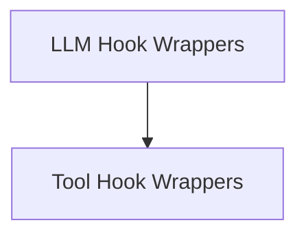

# Hook Wrappers Module

The `hook_wrappers` module in CrewAI provides a mechanism to inject custom logic before and after key operations such as LLM (Large Language Model) calls and tool invocations. It defines specialized wrapper classes that mark methods as hooks, enabling the CrewAI system to detect and register them during crew initialization.

This module is crucial for extending CrewAI's core functionality, allowing developers to implement custom logging, telemetry, input/output modification, or conditional execution based on the context of LLM and tool interactions.

## Architecture

The `hook_wrappers` module is structured into two main sub-modules, each responsible for handling a specific type of operation: LLM calls and tool calls. These sub-modules contain the wrapper classes that encapsulate the actual hook methods, providing metadata for the CrewAI system to identify and apply them appropriately.

<!-- DIAGRAM_JSON
{
    "direction": "TD",
    "nodes": [
        {"id": "llm_hook_wrappers", "label": "LLM Hook Wrappers", "type": "module", "link": "llm_hook_wrappers.md"},
        {"id": "tool_hook_wrappers", "label": "Tool Hook Wrappers", "type": "module", "link": "tool_hook_wrappers.md"}
    ],
    "edges": [
        {"source": "llm_hook_wrappers", "target": "tool_hook_wrappers"}
    ],
    "groups": []
}
-->

## Sub-modules

### [LLM Hook Wrappers](llm_hook_wrappers.md)
This sub-module contains the `BeforeLLMCallHookMethod` and `AfterLLMCallHookMethod` classes, which are used to wrap methods intended to run before and after LLM calls. They provide a standardized way to intercept and modify the context or outcome of LLM interactions.

### [Tool Hook Wrappers](tool_hook_wrappers.md)
This sub-module includes the `BeforeToolCallHookMethod` and `AfterToolCallHookMethod` classes. These wrappers enable the execution of custom logic before and after any tool is invoked, allowing for fine-grained control over tool usage and its effects.