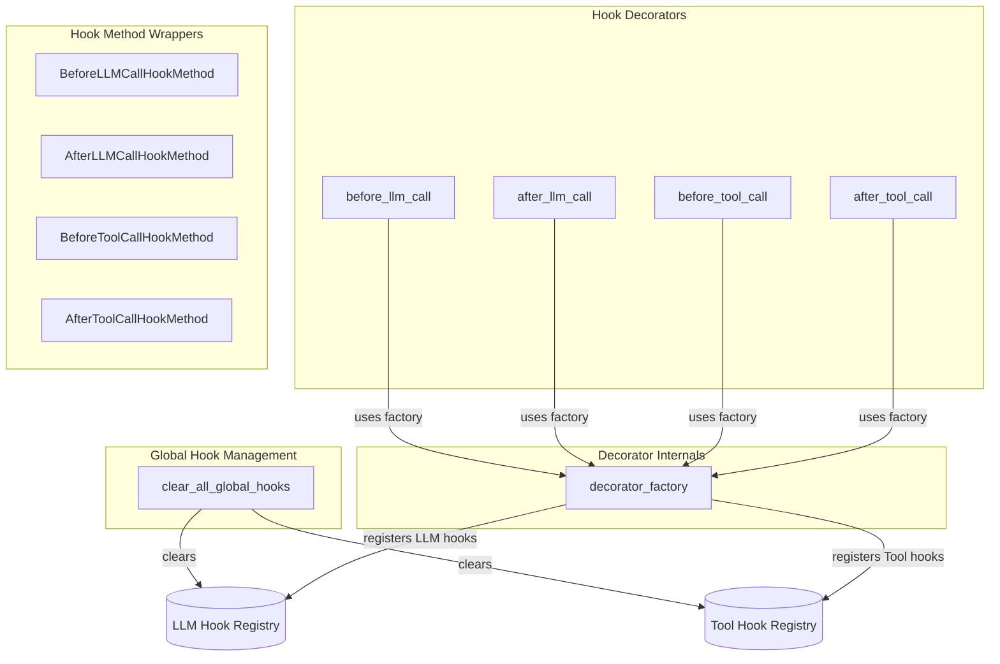

# hooks_and_memory
This module provides decorators for registering LLM and tool call hooks, along with wrappers for class methods acting as hooks, and a utility to clear all registered hooks.

<!-- DIAGRAM_JSON
{
  "nodes": [
    {"id": "clear_all_global_hooks", "label": "clear_all_global_hooks", "type": "function"},
    {"id": "decorator_factory", "label": "decorator_factory", "type": "function"},
    {"id": "before_llm_call", "label": "before_llm_call", "type": "function"},
    {"id": "after_llm_call", "label": "after_llm_call", "type": "function"},
    {"id": "before_tool_call", "label": "before_tool_call", "type": "function"},
    {"id": "after_tool_call", "label": "after_tool_call", "type": "function"},
    {"id": "BeforeLLMCallHookMethod", "label": "BeforeLLMCallHookMethod", "type": "class"},
    {"id": "AfterLLMCallHookMethod", "label": "AfterLLMCallHookMethod", "type": "class"},
    {"id": "BeforeToolCallHookMethod", "label": "BeforeToolCallHookMethod", "type": "class"},
    {"id": "AfterToolCallHookMethod", "label": "AfterToolCallHookMethod", "type": "class"},
    {"id": "LLM_Hook_Registry", "label": "LLM Hook Registry", "type": "external"},
    {"id": "Tool_Hook_Registry", "label": "Tool Hook Registry", "type": "external"}
  ],
  "edges": [
    {"source": "clear_all_global_hooks", "target": "LLM_Hook_Registry", "label": "clears"},
    {"source": "clear_all_global_hooks", "target": "Tool_Hook_Registry", "label": "clears"},
    {"source": "before_llm_call", "target": "decorator_factory", "label": "uses factory"},
    {"source": "after_llm_call", "target": "decorator_factory", "label": "uses factory"},
    {"source": "before_tool_call", "target": "decorator_factory", "label": "uses factory"},
    {"source": "after_tool_call", "target": "decorator_factory", "label": "uses factory"},
    {"source": "decorator_factory", "target": "LLM_Hook_Registry", "label": "registers LLM hooks"},
    {"source": "decorator_factory", "target": "Tool_Hook_Registry", "label": "registers Tool hooks"}
  ],
  "groups": [
    {"id": "Global_Management", "label": "Global Hook Management", "nodes": ["clear_all_global_hooks"]},
    {"id": "Hook_Decorators", "label": "Hook Decorators", "nodes": ["before_llm_call", "after_llm_call", "before_tool_call", "after_tool_call"]},
    {"id": "Decorator_Internals", "label": "Decorator Internals", "nodes": ["decorator_factory"]},
    {"id": "Hook_Method_Wrappers", "label": "Hook Method Wrappers", "nodes": ["BeforeLLMCallHookMethod", "AfterLLMCallHookMethod", "BeforeToolCallHookMethod", "AfterToolCallHookMethod"]}
  ]
}
-->
